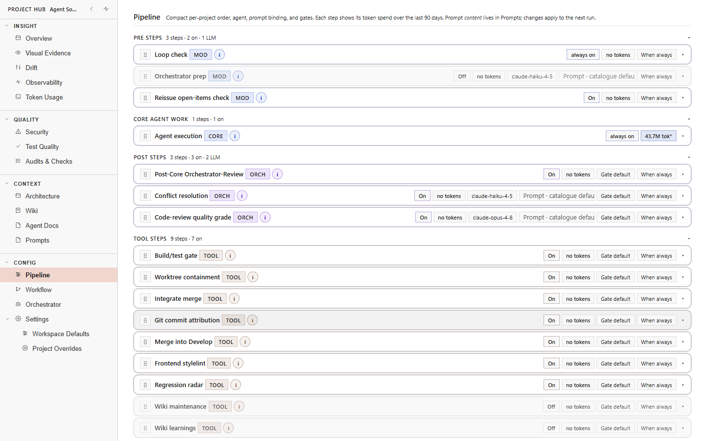
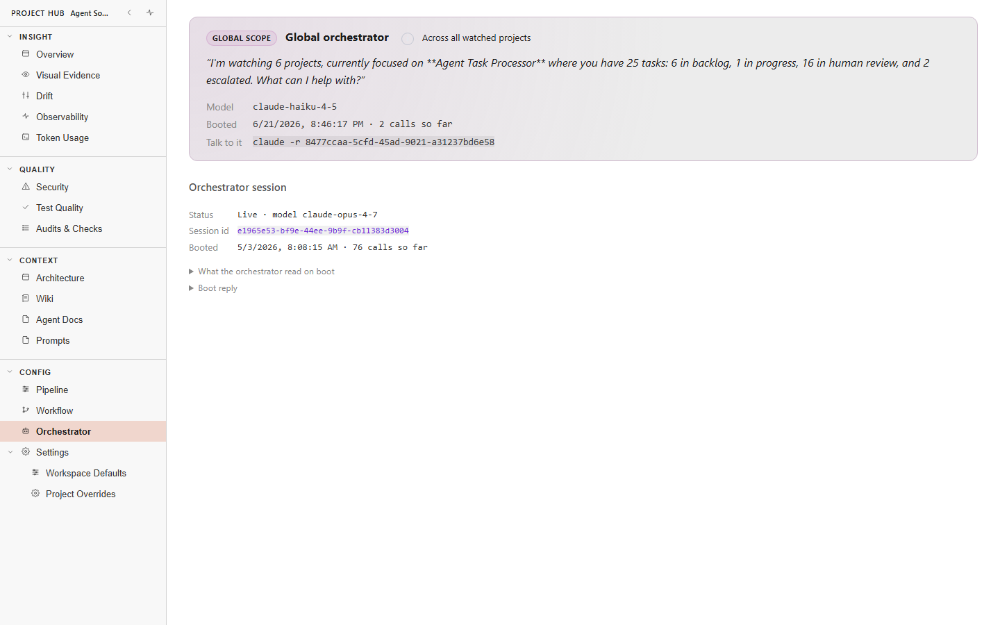
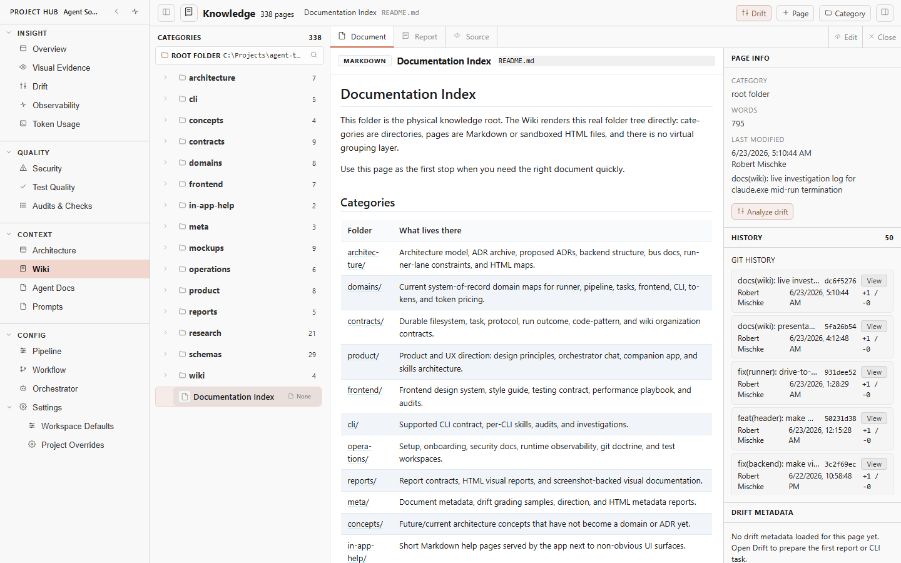
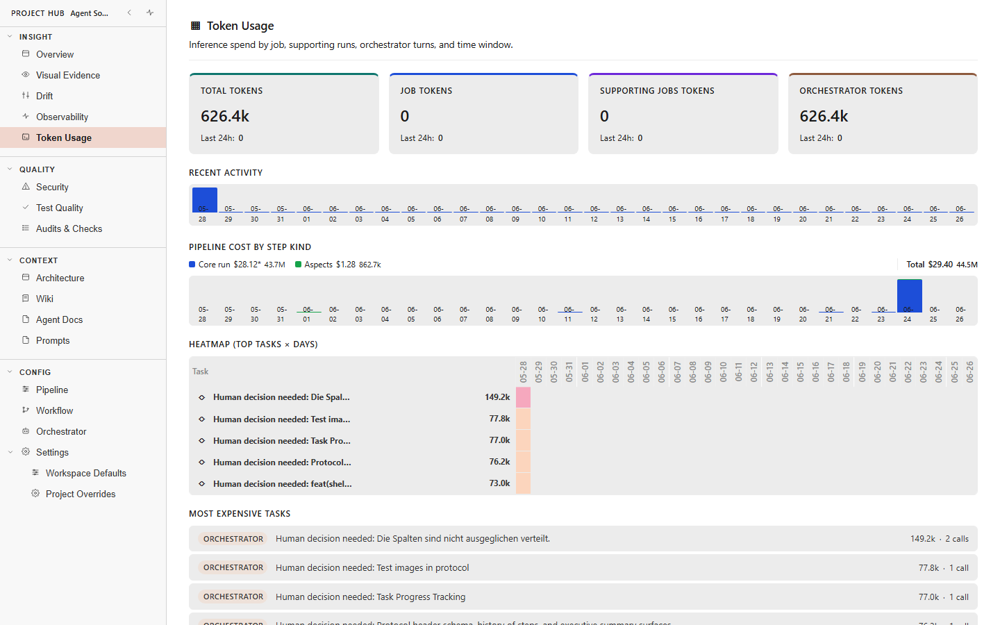

# agent-orchestrator

**A control plane for coding-agent CLIs.** Agent Studio gives you the human
surface, Task Server keeps the durable task and orchestration truth, and Agent
Runner executes work in controlled host environments. Claude Code, Codex,
GitHub Copilot, and Gemini remain the coding engines you already know and pay
for.

The product wraps each coding run in an explicit pre, core, and post pipeline.
It owns queueing, admission, evidence, review handoff, and deterministic outcome
policy. The provider CLI owns the model session, tools, approvals, and code
editing loop.


*One board across every watched project. Tasks flow `ready → in progress → review`; the runner picks them up automatically, so your role shrinks to the part that needs you — review.*

> .NET 10 backend + Angular 21 PWA. Newly onboarded task state lives in the central `TaskRepository`, separate from product repositories; legacy in-repository stores remain compatibility-only until migrated. The Task Access API fronts the filesystem so the runner, supervisor, frontend, remote clients, and scripts read and mutate through one boundary. Runs tasks through Claude Code, Codex, GitHub Copilot, or Gemini. Coding work is sequential by default and can opt into bounded, orchestrator-gated parallelism via `maxParallelism`.

## Highlights

### Pre & post step management



Every run is a configurable **pre / core / post** pipeline, not a single shot. Pre-steps prepare the work (loop check, orchestrator prep, reissue-open-items check); the **core** step is the provider CLI doing the actual coding; post-steps close it out (orchestrator review, conflict resolution, a code-review quality grade, build/test gate, worktree containment, merge to develop). Each step is independently toggled and bound to its own model, prompt, and gate, and shows its token spend over the last 90 days — so the managed work *around* the agent is explicit and tunable per project, not hidden in code.

### Agent orchestration



A per-project **orchestrator** owns queue movement — and it is a participant you can talk to, not a hidden daemon. It carries a long-lived session with inspectable memory (what it was booted with, which tasks and decisions it has seen), summarises the queue ("25 tasks: 6 in backlog, 1 in progress, 16 in human review, 2 escalated"), and is **deterministic, not prompt-trust**: when an agent's report contradicts the structural evidence — no edits, near-zero duration, a post-recovery no-op — the orchestrator re-issues the work itself instead of accepting the inconsistency. A supervisor layer above it watches health and budget every tick.

Every canonical chat turn is grounded in a compact application digest rather than a raw data dump. It covers the board pulse, active run phases, cached CLI quota, publish-target status, backend and watcher health, and recent decision-journal entries. The `global`, `project:<id>`, and `task:<projectId>/<taskKey>` context keys control what the digest may see, while an explicit refresh rebuilds it and re-probes quota.

### Context management — the project Wiki



An agent is only as good as the context it starts from. Each project's `docs/` tree becomes a browsable **knowledge base** — here, 338 pages grouped by category (architecture, contracts, domains, ADRs, skills, research), rendered from the real folder structure with page history and drift signals. The same steering documents the agents rely on (README, AGENTS, task contracts, skills lookup) are inspectable surfaces, so what the agents are told stays visible and reviewable rather than buried.

### Token economy & pricing



Inference spend is a first-class signal on every surface that touches a model. Per-job, per-step, per-model token aggregates are tracked and **priced**: a pipeline cost-by-step-kind breakdown in dollars (core run vs. aspects vs. tools), a recent-activity timeline, a top-tasks-by-day heatmap, and a most-expensive-tasks list with per-run drill-down. Cost is theoretical against a per-model price table — your CLI subscriptions make the real bill flat — but it shows exactly where the budget goes.

> **Naming note:** The product is **`agent-orchestrator`** (kebab-case, identical to the domain `agent-orchestrator.dev` — developer-tool convention like `fly.io`, `vercel`, `stripe`). The repository slug and several runtime strings still say "agent-taskboard" as a follow-up cleanup; see [docs/system/architecture/decisions/adr-archive.md](./docs/system/architecture/decisions/adr-archive.md) for the load-bearing rename note.

---

## Security first

agent-orchestrator treats security review as repeatable work with a task scope,
known inputs, durable evidence, and an explicit human decision. The goal is not
to trust model prose. The goal is to make the process inspectable: which model
ran, what it checked, what changed, which tests and screenshots exist, and which
risks remain.

The separated Task Server is deliberately loopback-only in its initial slice.
Do not expose it to a public network until the authentication, authorization,
Runner identity, and TLS work in the distributed architecture program is
complete. Its current management API is an operational boundary, not a public
internet security boundary. See the
[distributed target architecture](./docs/concepts/distributed-agent-studio-target-architecture.md)
and the [Task Server runbook](./docs/operations/setup/task-server.md).

## The bottleneck is you

Modern coding agents can run for hours, but hand-feeding one prompt at a time
leaves most of that capacity idle. The queue keeps work moving and reserves your
attention for decisions and review.

```text
WITHOUT A QUEUE                         WITH agent-orchestrator

you -> prompt -> agent -> review        queue -> Runner -> review
 ^                        |               |  ^                |
 |       idle gap         |               |  |                |
 +------------------------+               |  +----------------+
                                           |
                                           +-> next admitted task
```

Tasks are sequential within a project by default. A project may opt into
bounded parallelism only through orchestrator admission and isolated task
worktrees. Parallelism across projects is supported.

## Principles

**A layer on top of agents and software.** The product surfaces what the agents did and what changed in your software in one place. The top level is condensed (run summaries, commit counts, status badges); drill-down is always one click away (full activity log, diffs, tool calls). The full UX contract is in [docs/quality/design-principles.md](./docs/quality/design-principles.md) and is the bar every protocol-layer change has to clear.

**Make the patterns visible — and explain the why next to the lever.** A major part of this product is *exposing* the patterns and best practices the platform has accumulated, instead of hiding them in code or a wiki nobody opens. Every controllable behavior — agent permissions, sandbox modes, auto-commit/push, review thresholds, drift rules, skill catalog — should show up in Project Settings and the agent configuration surfaces *with* an inline explanation: what it does, why we picked this default, what the risk is, what the alternative would cost. The user should never have to leave the screen to understand a setting. Standalone docs in `docs/` remain the source of truth; the UI embeds the relevant section in-line at the spot the decision is made. See [docs/quality/design-principles.md §Inline meta](./docs/quality/design-principles.md#inline-meta-explain-decisions-next-to-the-lever).

**A living orchestrator, not a hidden daemon.** The orchestrator should be someone the user can talk to, not just code that moves folders. Each project has a canonical orchestrator session with inspectable memory: what it was booted with, which tasks and decisions it has seen, what the project does, what the roadmap says, and what should happen next. The long-term concept is documented in [docs/concepts/orchestrator-chat.md](./docs/concepts/orchestrator-chat.md).

**Sequential by default, bounded parallelism when opted in.** A project starts with one coding task at a time (`maxParallelism = 1`). When a project deliberately opts in, the orchestrator may admit several safe tasks at once, each isolated in its own git worktree on a short-lived `task/<id>` branch. Parallelism is capped, explained, and rejected for exclusive or cross-cutting work. Worktree isolation is not only a parallelism mechanism: every coding run, including a single-slot resume or reissue, always executes in its task worktree, never in the shared main checkout, backed by a fail-closed guard (ADR-0052 / ADR-0057).

**Security is a first-class workstream.** Security review is not a side quest at the end of a feature. It is a repeatable project-level activity with its own skills, evidence, history, and review surface. The board should make it normal to ask "when was this last reviewed, what was checked, what changed since then, and what evidence supports the conclusion?"

**Drift is a first-class project risk.** Long-running agentic work can drift between human intent, specs, tasks, jobs, ADRs, code, tests, design references, README, AGENTS, and marketing promises. The most important version is software drift: the actual source code, runtime behavior, tests, schemas, and module boundaries must stay aligned with the documented architecture. A project should be able to define a compact high-level architecture map with at most ten elements, then track drift per element.

**Use what you already pay for.** The runner drives **your** Claude Code, Codex, Copilot, and Gemini CLIs through their current provider accounts, subscriptions, credits, and usage rules. The product does not ask for model API keys or become a second model-billing layer. Its job is to make the provider CLI capacity you choose visible, routed and reviewable at task level.

**Use existing coding agents, not a custom agent runtime.** agent-orchestrator deliberately sits above productized coding agents instead of rebuilding their agent loop against raw model APIs. Claude Code, Codex, Copilot, and Gemini already bundle planning, editing, tool use, approvals, authentication, model routing, and subscription economics. The app's job is queueing, lifecycle control, evidence capture, review handoff, and cross-CLI fallback. If a run gets awkward, the user can still drop into the native CLI or VS Code integration with the same subscription and provider-owned session artifacts where the provider exposes them.

Building a custom coding agent is not a forbidden idea. Many projects do it. It is out of scope for this product while the best price/performance sits in polished subscription coding agents, especially Codex and Claude Code. This boundary can be revisited if model economics or provider capabilities make API-native execution clearly better.

**Assisted-coding harness around the CLI run.** Each managed run has a pre/core/post shape. The app owns the pre-step (task scope, context, CLI choice, acceptance criteria, worktree/branch setup when needed), the core step starts the configured provider CLI as the execution engine, and the post-step collects output, logs, diffs, screenshots, checks, token or usage data where available, and the human review decision. That is the product boundary: assisted coding around a task, not a hidden replacement for the provider's agent loop.

**Maximize token utilization, keep bookkeeping load-bearing.** The default path stays small, and extra machinery appears only when it protects real throughput:

| What it skips | Why |
|---|---|
| Provider CLIs stay the execution engines | No hidden raw-model coding runtime and no second model-billing layer. |
| Deterministic policy beats prompt trust | Typed sentinels, fences, state transitions, and evidence decide outcomes. |
| One durable task truth | Studio and Runner use the Task Server API; Runner keeps execution worktrees and bounded delivery state, not a task store. |
| Execution belongs on Runner hosts | CLI processes, host probes, repositories, worktrees, build tools, and Playwright stay outside Task Server. |
| Human review stays explicit | Post-processing may recommend, reissue, or escalate, but `5-human-review` is the final product gate. |
| Sequential is the safe default | Intra-project concurrency is opt-in, bounded, and worktree-isolated. |
| Evidence is part of the result | Logs, events, artifacts, screenshots, diffs, audit, and run identity survive UI restarts. |
| Small, typed components beat a workflow engine | Shared contracts and deterministic policy libraries support three runtime products without unbounded fan-out. |

The fuller UX contract lives in
[design principles](./docs/product/design-principles.md). Load-bearing
architecture decisions are preserved in the
[ADR archive](./docs/architecture/decisions/adr-archive.md).

## What you see

### Board

The board projects task state across projects and lanes, with compact signals
for task type, phase, Runner, model, review, token usage, Git state, and recent
activity. Workspace and component scopes can evolve without turning filesystem
paths into public identity.


### Task detail

The detail surface keeps task intent and run evidence together. Prompt history,
the pre/core/post pipeline, status projection, timeline, output, artifacts,
screenshots, and Git evidence remain inspectable instead of disappearing into a
terminal scrollback.


### Three-pane inspection

Dense inspection surfaces keep the task, its protocol, and the changed software
close enough to compare without hiding the full evidence. Summary first and
drill-down second is the default interaction pattern.


### Review handoff

A task is review-ready when the outcome, changed files, tests, artifacts,
remaining gate items, and exact run identity agree. An agent saying "done" is
not enough.

Claude Code, Codex, GitHub Copilot, Gemini. Per-CLI model catalogue from `/api/cli/{type}/models`. The status bar provides a compact quota glance. Workspace Settings is the single management destination: its CLI Management section combines models, environments, completion contracts, sessions, usage caps, and token spend at `#/workspace/settings/caps`. Cross-CLI fallback is available when a session is stuck on one provider.

### Live data: visibility-aware polling

Eight `TaskBackgroundPoller<T>` subclasses keep the open detail and the board fresh without burning requests on a hidden tab, each declaring what to fetch and what to do with the response: Claude session telemetry, run timeline, and plan (5 s each); agent-work-summary, screenshots, session events, task timeline, and task pipeline (10 s each). The CLI output log buffer runs on its own self-rescheduling cadence outside that shared base, with two-buffer dedup between the server-confirmed buffer and optimistic user echoes so a just-sent message appears before the next poll confirms it.

### Orchestration: deterministic, not prompt-trust

Per-project orchestrator owns queue movement. A long-lived orchestrator session carries the manager voice across runs and surfaces in a project-side sheet with chat composition and a project picker. The deterministic post-run policy parses `[[TASK_DONE]]` / `[[TASK_BLOCKED:<reason>]]` / `[[TASK_NEEDS_INPUT:<reason>]]` / `[[TASK_NOOP]]` sentinels from the CLI buffer; when the agent's report contradicts structural evidence (no edits, near-zero duration, after a session-loss recovery with a user follow-up), the orchestrator re-issues the work itself instead of accepting the inconsistency. The decision tree is matrix-tested. A supervisor layer above the runner observes health and budget every tick and emits typed advisories + interventions when something looks stuck.

The side-sheet chat and canonical session-turn API share one ORCH-1 digest builder. Global context folds all registered projects; project and task contexts stay project-isolated, with task context adding a focused card. The side sheet shows the real capture freshness and its Refresh action forces a digest refresh without granting any new mutation authority. See [docs/concepts/orchestrator-in-app.md](./docs/concepts/orchestrator-in-app.md) for the scoped read contract and the explicit ORCH-2/ORCH-3 boundary.

### Token economy

First-class signal on every surface that touches inference. Per-job, per-project, per-model token aggregates persist in JSONL. The workspace token-timeline overlay (`#/workspace/tokens`) renders 1h / 6h / 24h / 168h windows. The status-bar usage hover panel combines quota windows + token totals in one modal. Per-project token-usage panel adds heatmap + expensive-jobs + per-job drill-down with run-by-run breakdown. Category split (`job` / `supporting` / `orchestrator`) follows the published taxonomy.

### Self-update

A nine-phase update pipeline (stop, pull, install, build, verify, restart, retry-on-failure) updates the dev or stable checkout from inside the running app. Update Center surface, version badge in the header, full-screen click-blocking block-modal that survives F5 because the FE keeps polling. Stable update through a separate `update-stable.sh` script that the FE triggers; the dev checkout pulls + builds locally. ADR-0031 records the load-bearing decision.

### Visual evidence

Per-task screenshot strip in the protocol pane plus a workspace-wide visual evidence reel (`#/workspace/screenshots`) grouped by hour bucket with lightbox prev / next navigation. Files live under each task's `results/`. Routable URLs serve the files directly so screenshots can be linked from chat or external review.

### Chat: a shared library, not an in-app implementation

The task Activity tab and the project orchestrator side sheet both render chat through **`coding-agent-chat`**, a standalone Angular library the app hosts rather than reimplements (the former in-app chat components were deleted when this landed). The composer entry point (`<cac-chat>`) carries role badges, the unified CLI + model selector (`<cac-model-selector>`: CLI type, model, thinking level, reused across roughly ten call-sites app-wide), and a host-fed project plus active-surface context in its standard footer. Studio derives that context once from its canonical active-tab state and updates it without remounting the composer. The conversation entry point (`<cac-conversation-view>`) renders a parsed `ConversationEvent` grammar as a single-pane transcript with coalesced per-actor turns, a `<cac-context-ring>` context-usage gauge, tool-burst chips that unify Claude's and Codex's tool activity into one shape, and terminal sentinels / runtime markers classified into semantic chips instead of raw text. The history entry point adds virtualised, full-text-searchable project chat history for projects with hundreds of turns. `Frontend:NextGenChat` (default on) gates the conversation grammar independently from `Frontend:VsCodeLayout` (app-shell chrome); the Verbose Debug overlay is the read-only deep-inspection variant of the same projection.

### Foundation

.NET 10 backend (port 5030) + Angular 21 PWA (port 4010). Twenty-eight JSON schemas under [`docs/system/schemas/`](docs/system/schemas/) cover Agent Message Bus events, supervisor advisories + interventions, drift reports, analysis reports, architecture model, product runtime events, token aggregates, task find / mutate, orchestrator decisions, and update-run snapshots. Twenty-five frontend feature folders under [`frontend/src/app/features/`](frontend/src/app/features/) carry the per-feature components / state / models with public APIs exported via barrel files (ADR-0034). Append-only Agent Message Bus persists every cross-cutting structured signal as JSONL.

Out of scope on purpose: API-key billing, mandatory sandboxes, general workflow engines, custom coding-agent runtimes, or unbounded fan-out. Worktrees and short-lived task branches are in scope as the isolation mechanism for every coding run, opted-in parallel coding included (ADR-0052 / ADR-0057). The product is small by design; every capability above answers a question the existing CLI agents do not, while leaving them to do the actual coding.

### Review handoff: what makes a task review-ready


*A review-ready task. The git pane shows the work merged `task/… → develop → main` with the full per-file diff (added/modified, line counts) — the concrete change a reviewer signs off on, next to the run protocol and evidence.*

When a CLI run completes successfully, the application captures the run log, moves the task to `4-review`, writes a concise English protocol into `status.md`, and preserves review evidence such as screenshots under the task's `results/` folder.

Failed or stopped runs stay in `3-progress` so the user can inspect, restart, or continue them. The agent works on the selected task. The application owns pickup, continuation, stopping, state movement, protocol generation, slot admission, and worktree/branch lifecycle when parallel mode is enabled. That boundary is the point: the queue keeps moving without asking the model to decide what should run next.

---

## Deterministic orchestration over prompt trust

Agents classify their result with a terminal sentinel:

- `[[TASK_DONE]]`
- `[[TASK_BLOCKED:<reason>]]`
- `[[TASK_NEEDS_INPUT:<reason>]]`
- `[[TASK_NOOP]]`

1. **Hard signals from the agent.** Every prompt template asks the agent to end its run with one of `[[TASK_DONE]]`, `[[TASK_BLOCKED:<reason>]]`, `[[TASK_NEEDS_INPUT:<reason>]]`, or `[[TASK_NOOP]]`. These tokens are parsed from the output buffer and treated as authoritative. The full agent contract lives in [docs/system/contracts/agent-task.md](./docs/system/contracts/agent-task.md).
2. **Deterministic post-run policy.** When the agent's report contradicts structural evidence (no edits, near-zero duration, after a recovery with a user follow-up), the orchestrator re-issues the work itself with a sharper framing instead of accepting the inconsistency. The decision tree is in `backend/Features/Runner/RunOutcomePolicy.cs` and is unit-tested as a matrix.
3. **An orchestrator voice in the chat.** The orchestrator is a first-class participant in the activity log (alongside `You` and the agent). When it re-issues a follow-up, accepts a heuristic verdict, or gives up after a retry, it says so in the chat so the user can see what the system decided and why. Heuristic fallback always surfaces a warning, so the user notices when the deterministic contract did not match.

Task Server owns durable orchestration state, admission, leases, monotonic
fences, events, artifacts, audit, and management operations. A restart restores
that authority before readiness. Any previously active attempt becomes
`process-unknown` and blocks replacement until an operator supplies positive
containment proof. Lease expiry alone never proves that a process stopped.

Prompt wording remains the easiest way to steer behavior, but it is not the load-bearing layer anymore. The product treats orchestrator-to-CLI communication as a core capability.

The next layer of this thinking is *supervision*: a meta-loop that watches the orchestrator's own job-pickup loop in real time, asks "is the agent on track, is anything stuck, should we intervene?", and writes its own continuous protocol. Implementation lives under [backend/Features/Supervisor/](backend/Features/Supervisor/) with a dedicated UI panel on each project page; auto-intervention stays opt-in. The full conceptual analysis (loop-to-loop control, communication contract, traceability) is in [docs/research/orchestrator-meta-loop-analysis-2026-05-04.md](docs/research/orchestrator-meta-loop-analysis-2026-05-04.md); the load-bearing decision is recorded as [ADR-0017](./docs/system/architecture/decisions/adr-archive.md). A lower-frequency meta-cycle above the runner can pause at batch boundaries, inspect the system, write a structured report, then resume or queue follow-up work. Its current spec is [docs/mockups/orchestrator-meta-cycle/](docs/mockups/orchestrator-meta-cycle/) and the decision is [ADR-0022](./docs/system/architecture/decisions/adr-archive.md). A stand-alone external review monitor (Layer 3) for stable lives at [scripts/supervisor/](scripts/supervisor/).

---

## Meta documentation, task evidence, and commits

Meta-level work is allowed to run as small, parallel CLI interactions when it is truly independent from active coding work. Examples: analyze the orchestration model, update README or ROADMAP, or write a research note under `docs/`. These reports and edits are normal product memory, but directly-invoked agents leave them in the working tree unless the operator explicitly asks for commit or push in that task.

Recurring or manual meta-analyses are also product memory. Examples: "are we on track?", "what changed in the last few hours?", "which jobs are stale?", "does the queue match the roadmap?", "which docs drifted?", or "what should become follow-up work?" Their result should be a Markdown report for humans plus structured JSON when the app needs to aggregate, filter, or trend the findings. These reports belong in a project-level analysis area or in the relevant task evidence, depending on scope. They should reference raw evidence rather than copying entire logs, and any implementation follow-up becomes a normal queued task.

The orchestrator should use these reports to improve the steering layer over time. When multiple tasks show the same failure pattern, ambiguous prompt shape, recurring blocked reason, missing test expectation, or repeated CLI handling issue, a meta-analysis should point to the evidence and propose a README, AGENTS, task-contract, skill, or process update. That proposal must be visible and reviewable. The product should not secretly rewrite the instructions that agents rely on.

Agent-facing steering documents are product surface, not hidden implementation detail. A project page should make the relevant README, AGENTS, task contract, skills lookup, ADR index, and project-specific notes inspectable, with a shorter human summary on top that explains what the agents are being told and flags where the guidance looks stale, conflicting, or incomplete.

Task-level feedback is different. Security audits, code-review findings, task checks, screenshots, run protocols, and reviewer notes belong with the task evidence under the central `<TaskRepository>/projects/<projectId>/tasks/<state>/<task>/` store. They never belong in the product checkout. If that evidence reveals new product work, create a normal queued task instead of burying the work inside the report.

Repositories should not stay dirty after a task is accepted. When a task reaches review or completion and its changes are accepted, commit and push the changed software in the product repository unless the user has explicitly held the push back. Keep task evidence durable in the central task store's own evidence Git repository, never in the product repository. The product should make uncommitted and unpushed software or evidence visible so finished work does not quietly pile up on disk.

Direct-agent maintenance follows the same ownership boundary as managed task runs: a small documentation, mockup, prompt, roadmap, or task-queue change should be reported with changed files and verification, then committed or pushed only by an explicit operator action. That keeps project memory durable without letting a worker session author history on its own.

---

## Portable skills, not CLI-local silos

Skills are repository-visible workflows, not private knowledge trapped inside
one CLI. Managed runs can attach them deterministically, and direct CLI sessions
can discover the same instructions through repository guidance. CLI-native
skill formats are adapters, not the source of truth.

The skill model has two layers:

1. **Central skill library.** agent-orchestrator owns the canonical skill library. Standard skills ship with the processor; project-specific skills are managed there too, scoped to one or more watched projects.
2. **Project lookup contract.** Each watched project should expose a small README or agent-instruction section that tells direct CLI agents where to find the relevant central skills. That keeps skills useful even when the user works directly in Codex, Claude Code, Copilot, or Gemini outside the orchestrator.

During a managed taskboard run, the orchestrator can attach selected skills to the prompt stack explicitly. During direct CLI work, the project's README acts as the common lookup point. Native CLI skill exports may be added later, but the Markdown lookup contract is the agent-neutral base.

The full concept lives in [docs/concepts/skills-architecture.md](./docs/concepts/skills-architecture.md). The load-bearing decision is archived in [docs/system/architecture/decisions/adr-archive.md](./docs/system/architecture/decisions/adr-archive.md).

---

## How it's wired

All task operations flow through the API. Direct filesystem mutation is reserved for the API host process.

The system is layered:

1. **Filesystem on disk.** Central `<TaskRepository>/projects/<projectId>/tasks/<lane>/<task>/` folders hold `job.json`, `prompt.md`, `status.md`, `logs/`, and `results/`. Disk stays the source of truth on cold start; the product checkout remains separate.
2. **Task Access API.** A typed software layer in the backend owns reads, lists, mutations, and lane transitions. It boots once, indexes every watched project's lane folders, watches the filesystem for external changes, serves cheap reads off the index, and accepts narrowly typed mutations. See [ADR-0024](./docs/system/architecture/decisions/adr-archive.md) for the layer design and the queued `task-access-api-layer-extraction` work for the migration phasing.
3. **Services and clients consume the API.** The runner, the supervisor, the frontend PWA, the meta-cycle, and external scripts go through the API. They do not touch the lane folders directly. The same boundary mirrors mutations onto the [agent message bus](./docs/system/architecture/bus/agent-message-bus.md) so every cross-cutting structured signal lands in one observable timeline.

```text
Agent Studio SPA
      |
      | HTTPS or loopback HTTP during local development
      v
optional Studio BFF --------------+
      |                            |
      +----------------------------+
                                   v
                         +---------------------+
                         | Task Server         |
                         | durable control     |
                         | plane and truth     |
                         +----------+----------+
                                    |
                                    | versioned Runner API
                                    v
                         +---------------------+
                         | Agent Runner        |
                         | CLI and host work   |
                         +----------+----------+
                                    |
                                    v
                         Git repositories and
                         isolated worktrees
```

| Source package | Boundary |
|---|---|
| `contracts/TaskServer.Contracts` | Versioned DTOs and compatibility range shared by Studio, Server, and Runner. |
| `task-server` | Independently installable control-plane service with SQLite migrations, health, backup/restore, modes, stable IDs, and durable fences. |
| `studio-bff` | Optional stateless proxy. It has no task persistence and no process ownership. |
| `runner` | Standalone execution service. It negotiates protocol v1 before registration or claim. |
| `frontend` | Angular view composition and local UI state. |

Protocol fixtures under `contracts/fixtures/` pin supported mixed product
versions. A separated Task Server rejects a missing or unsupported Runner
protocol with HTTP 426 before registration or claim. The Runner retains a
protocol-v0 adapter only for the local migration window; new wire behavior uses
the shared contract package.

Legacy filesystem task stores remain migration input until an operator performs
the rehearsed single-writer cutover. After cutover, neither the legacy Studio
backend nor a Runner may act as a second durable task authority.

## Running

For the established local development stack:

```bash
./api.sh
cd frontend
npm install
npm start
```

The dev backend is offline by default in managed test runs. Follow
[AGENTS.md](AGENTS.md) and the
[setup guide](./docs/operations/setup/getting-started.md) for the supported
lifecycle.

To run the separated components from source on loopback:

```bash
dotnet run --project task-server/TaskServer.csproj
dotnet run --project studio-bff/StudioBff.csproj
dotnet run --project runner/AgentRunner.csproj -- --poll
```

Set `TASK_SERVER_PROFILE=local-compatibility` for a zero-argument Task Server on
`127.0.0.1:5031` using the current user's application-data directory. Production
installation, systemd supervision, drain, safe shutdown, migration,
backup/restore, and upgrade rehearsal are in the
[Task Server runbook](./docs/operations/setup/task-server.md).

## Dev vs stable checkout

Stable is the supervisor seat. The active dev checkout or assigned task
worktree is where changes are made and verified. Never edit
`agent-taskboard-stable/` from a managed task. Stable updates happen only at a
verified quiet boundary through the repository's update process.

- `POST /api/clients/register` - register a client identity and obtain the `X-Client-Id` value.
- `GET /api/clients`, `GET /api/clients/{id}`, `DELETE /api/clients/{id}` - list, inspect, and retire clients.

**Supervisor and meta-cycle**

- `POST /api/supervisor/{project}/intervene/cancel-run`, `POST /api/supervisor/{project}/intervene/pause-pickup`, `POST /api/supervisor/{project}/intervene/force-fail`, `POST /api/supervisor/{project}/intervene/resume` - supervisor interventions.
- `GET /api/supervisor/{project}/meta-cycle` - meta-cycle status and recent reports.
- `GET /api/supervisor/{project}/observation`, `GET /api/supervisor/{project}/recent-events` - advisories, interventions, and recent activity for the project.

The wire shape for find / mutate is fixed in [`docs/system/schemas/task-find-result.schema.json`](docs/system/schemas/task-find-result.schema.json) and [`docs/system/schemas/task-mutation-request.schema.json`](docs/system/schemas/task-mutation-request.schema.json). The architectural decision is recorded in [ADR-0024](./docs/system/architecture/decisions/adr-archive.md); the migration of the remaining direct-filesystem call sites is tracked under the queued task `task-access-api-layer-extraction`. Mutations are mirrored onto the [agent message bus](./docs/system/architecture/bus/agent-message-bus.md) as events.

---

## Outlook: remote execution (in progress, not yet shipped)

Everything above runs on one Windows machine today: backend(s), frontend(s), every CLI agent process, and every Playwright run share the operator's box. [ADR-0059](./docs/system/architecture/decisions/adr-archive.md) promotes moving that execution load off the operator's machine to a **major goal**: coding-agent CLIs and Playwright running on one or more remote Linux runner hosts (SSH-provisioned), with tasks living behind a task server reachable under one central URL, while the operator machine keeps only the browser seat and the Windows-native dev seat. This is a phased plan, not a shipped capability: the current single-machine setup keeps working at every phase. The plan of record, with its ground-truth coupling survey and phase breakdown, is [docs/research/remote-ready-kickoff-2026-07.md](./docs/research/remote-ready-kickoff-2026-07.md).

---

## How to get started

Tell your favorite coding agent to clone the repository and to get it done. All necessary information needed to start the application is inside [AGENTS.md](AGENTS.md), so don't worry. Let the coding agent do the work.

If you want to install and configure manually, the technical walkthrough lives in [docs/operations/setup/getting-started.md](./docs/operations/setup/getting-started.md).

---

## Docs

- [docs/start/README.md](docs/start/README.md) — **hierarchical lookup index** of every load-bearing document with a one-line description per file. Start here when you don't already know which doc to read.
- [AGENTS.md](AGENTS.md) — canonical agent instructions
- [ROADMAP.md](ROADMAP.md) — product direction, roadmap themes, and decision principles
- [PATHS.md](PATHS.md) — path conventions
- [prompts/runtime/](prompts/runtime/) — editable backend runtime prompt templates

The four most-asked-for individual documents (the index covers the full set):

- [docs/system/cli/supported-clis.md](./docs/system/cli/supported-clis.md) — CLI integration contract
- [docs/system/contracts/filesystem.md](./docs/system/contracts/filesystem.md) — task folder contract
- [docs/system/contracts/agent-task.md](./docs/system/contracts/agent-task.md) — application and agent ownership boundary
- [docs/system/architecture/decisions/adr-archive.md](./docs/system/architecture/decisions/adr-archive.md) — ADR archive with the load-bearing decisions
- [docs/concepts/orchestrator-chat.md](./docs/concepts/orchestrator-chat.md) — persistent orchestrator chat, memory, scope, and control surface
- [docs/concepts/orchestrator-chat-redesign-handoff.md](./docs/concepts/orchestrator-chat-redesign-handoff.md) — conversation-first chat redesign handoff
