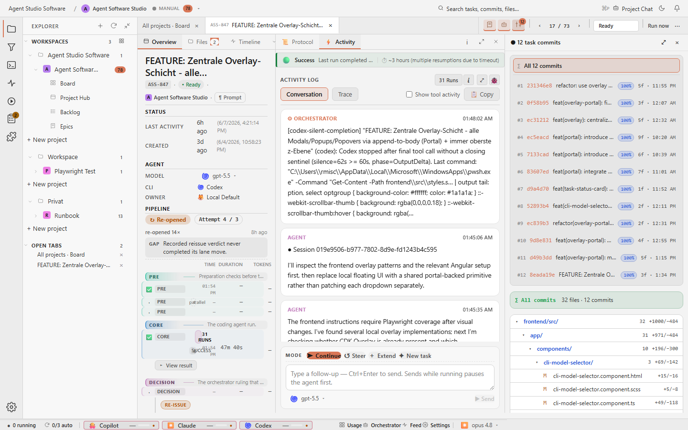

# Agent Task Processor

**Stop being the bottleneck.** A local Kanban board that feeds your coding-agent CLIs a continuous queue of work, using the subscriptions you already pay for, on the machine you already own.


> .NET 10 backend + Angular 21 PWA. Watches one or more project folders for `.orchestrator/jobs/` directories and runs them sequentially through Claude Code, Codex, GitHub Copilot, or Gemini.

---

## The bottleneck is you

Modern coding agents can run for hours. They don't get tired. They don't context-switch. They just need a steady queue of work.

The bottleneck isn't the model. It's the human babysitting it: paste a prompt, watch it run, review, paste the next one. Every minute spent on that loop is a minute your subscription's token bucket sits idle.

```
  WITHOUT a queue                          WITH Agent Task Processor
  ───────────────                          ─────────────────────────

  you ──► prompt ──► agent ──► review      queue ──► agent ──► review
   ▲                            │            │ ▲                │
   │       (idle, you blink)    │            │ │                │
   └────────────────────────────┘            │ └────────────────┘
                                             │   (auto pickup)
   utilization: ~10–20% of the hour          │
                                             ▼
                                          next task
                                          
                                          utilization: ~95% of the hour
```

The board exists to make the queue the only thing you maintain. Tasks land in `2-ready`, the runner walks them through `3-progress → 4-review` automatically, and your role shrinks to **review**, the one part that actually needs you.

---

## Principles

**Sequential within a project, never parallel.** One task at a time per project. No worktrees. No branch-per-task. No intra-project fan-out. Parallelism only exists *across* projects (different watch paths run independently).

**Use what you already pay for.** The runner drives **your** Claude Code, Codex, Copilot, and Gemini CLIs through their existing subscriptions. **No API keys. No per-token billing.** Your Pro/Max plan is the budget; the board's job is to use as much of it as productively as possible.

**Maximize token utilization, minimize bookkeeping.** Skip the things that burn time and tokens for marginal benefit:

| What it skips | Why |
|---|---|
| Worktrees | Spinning up a worktree per task triples I/O for no gain when work is sequential. |
| Virtualization / sandboxes | Adds startup latency and forces the agent to re-discover the workspace every run. |
| Cross-task orchestration | Workflow engines, branch coordination, merge bots. The sequential model removes this overhead by construction. |
| API-key-based execution | Subscriptions already cover this. Paying twice is silly. |

The product is small on purpose. Any feature that pulls toward "let's run two agents on one project" is out of scope. That's where complexity (and bills) explode.

---

## What you see

### Board: every watched project, every state


Six lanes, `1-preparation`, `2-ready`, `3-progress`, `4-review`, `5-completed`, and `6-archive`, are driven directly off the filesystem. Each card shows the CLI, the model, the task size, and last activity. The pill in the header says how many projects are running on auto-pickup.

### Detail view: task description + live protocol


Click a card and you get the prompt on the left and the agent's protocol on the right. The protocol is a parsed, human-readable summary of what the agent has done so far, pulled from `status.md` and `cli-output.log` and re-rendered after every run.

### Three panes: task, protocol, live git



Toggle the Git panel to see what the agent actually changed in the project's working tree, file by file, while it works. No leaving the board to alt-tab into a terminal.

### Review handoff: what makes a task review-ready


When a CLI run completes successfully, the application captures the run log, moves the task to `4-review`, writes a concise English protocol into `status.md`, and preserves review evidence such as screenshots under the job's `results/` folder.

Failed or stopped runs stay in `3-progress` so the user can inspect, restart, or continue them. The agent works on the selected task. The application owns pickup, continuation, stopping, state movement, protocol generation, and the one-active-task rule. That boundary is the point: the queue keeps moving without asking the model to decide what should run next.

---

## Deterministic orchestration over prompt trust

A second product principle, separate from the queue model: **the orchestrator is a deterministic arbiter, not a passive logger.** What the agent says about its own run is one input among several, never the only one.

This matters because prompt-based steering ("treat this as a continuation", "don't say done unless you actually did the work") fails silently. An agent that no-ops a follow-up after a session loss and replies "task done" used to slip through. The fix is structural:

1. **Hard signals from the agent.** Every prompt template asks the agent to end its run with one of `[[TASK_DONE]]`, `[[TASK_BLOCKED:<reason>]]`, `[[TASK_NEEDS_INPUT:<reason>]]`, or `[[TASK_NOOP]]`. These tokens are parsed from the output buffer and treated as authoritative. The full agent contract lives in [docs/agent-task-contract.md](docs/agent-task-contract.md).
2. **Deterministic post-run policy.** When the agent's report contradicts structural evidence (no edits, near-zero duration, after a recovery with a user follow-up), the orchestrator re-issues the work itself with a sharper framing instead of accepting the inconsistency. The decision tree is in `backend/Services/Runner/RunOutcomePolicy.cs` and is unit-tested as a matrix.
3. **An orchestrator voice in the chat.** The orchestrator is a first-class participant in the activity log (alongside `You` and the agent). When it re-issues a follow-up, accepts a heuristic verdict, or gives up after a retry, it says so in the chat so the user can see what the system decided and why. Heuristic fallback always surfaces a warning, so the user notices when the deterministic contract did not match.

Prompt wording remains the easiest way to steer behavior, but it is not the load-bearing layer anymore. The product treats orchestrator-to-CLI communication as a core capability.

---

## How it's wired

```
┌─────────────────────────────┐     ┌──────────────────────────────────┐
│  agent-taskboard/           │     │  Target project (e.g. C:\Proj\X) │
│  ════════════════           │     │  ═══════════════════════════════  │
│  App source code:           │     │  Where the agent works:          │
│  - backend/  (.NET 10 API)  │     │  - src/, lib/, ...               │
│  - frontend/ (Angular PWA)  │     │  - .orchestrator/                │
│  - docs/                    │     │    └── jobs/                     │
│  - .github/prompts/         │     │        ├── 1-preparation/        │
│                             │────►│        ├── 2-ready/              │
│  Reads / watches the        │     │        ├── 3-progress/           │
│  target's jobs/ folder.     │     │        ├── 4-review/             │
│  Stores no jobs of its own. │     │        ├── 5-completed/          │
│                             │     │        └── 6-archive/            │
└─────────────────────────────┘     └──────────────────────────────────┘
```

| Location | Contents |
|----------|----------|
| `agent-taskboard/` | App source, prompts, docs |
| `<target-project>/.orchestrator/jobs/` | `job.json`, `prompt.md`, `status.md`, `logs/` per task |

One task processor, many targets. The board watches several projects in parallel; inside each project, work is strictly serial.

---

## Running

Backend on `http://localhost:5030`, frontend on `http://localhost:4010`. Agents must use the `sh` variant.

```sh
./api.sh start                       # backend
npm start --prefix frontend          # or VS Code task "Frontend: Start"
```

### Dev vs. stable checkout

All code edits happen in the **dev** checkout. The stable checkout exists for reference and gets changes via `git pull` from `main`, never via direct edits. The dev checkout marks itself visually so the two never get confused:

- An orange "DEV" stripe is pinned to the top of the window.
- The PWA install icon and favicon use an orange variant with a "DEV" corner ribbon.
- The window title becomes `Agent Task Processor (DEV)`.

These markers activate when the backend serves `/api/environment` with `{ isDev: true }`, which it does iff a local-only `backend/appsettings.Local.json` file is present:

```json
// backend/appsettings.Local.json, gitignored, dev checkout only
{
  "Environment": {
    "IsDev": true
  }
}
```

The file is gitignored so it stays per-checkout. Stable lacks the file, so the same code produces the un-marked appearance there.

### Configuration

```json
// backend/appsettings.json
{
  "WatchPaths": [
    {
      "Name": "Runbook",
      "RootPath": "C:\\Projects\\Runbook\\App",
      "RepositoryPath": "C:\\Projects\\Runbook"
    },
    { "Name": "My Other Project", "RootPath": "C:\\Projects\\OtherApp" }
  ]
}
```

`RootPath` is the CLI working directory and the place where the board reads `<RootPath>/.orchestrator.yml` for `projectKey`. Jobs then resolve under `agent-taskboard-workspace/projects/<projectKey>/`.

`RepositoryPath` is optional. Use it when the Git repository root differs from the CLI working directory, for example a monorepo or a source app under a parent repository. Git status, diff, commits, and the VS Code handoff use `RepositoryPath`; when it is omitted, they fall back to `RootPath` and still ask Git for the work-tree top-level.

### Supported CLIs

Claude Code, Codex, GitHub Copilot, Gemini. The contract every CLI must satisfy, including process lifecycle, session model, model selection, quota probing, logging, and cancellation, is in [docs/supported-clis.md](docs/supported-clis.md).

### Keeping target projects in sync

When the agent task contract or folder schema changes, run the `/sync-target-instructions` prompt against each target.

---

## Docs

- [AGENTS.md](AGENTS.md) - canonical agent instructions
- [ROADMAP.md](ROADMAP.md) - product direction, roadmap themes, and decision principles
- [docs/supported-clis.md](docs/supported-clis.md) - CLI integration contract
- [docs/filesystem-contract.md](docs/filesystem-contract.md) - job folder contract
- [docs/agent-task-contract.md](docs/agent-task-contract.md) - application and agent ownership boundary
- [prompts/runtime/](prompts/runtime/) - editable backend runtime prompt templates
- [PATHS.md](PATHS.md) - path conventions
