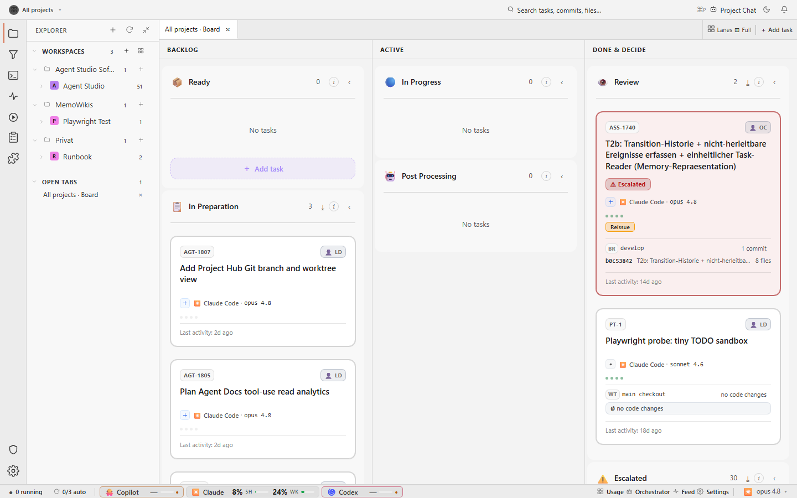
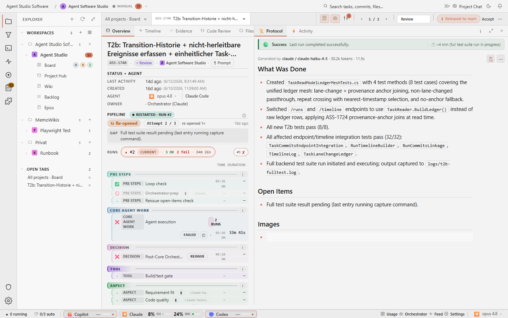

# agent-orchestrator

**A control plane for coding-agent CLIs.** Agent Studio gives you the human
surface, Task Server keeps the durable task and orchestration truth, and Agent
Runner executes work in controlled host environments. Claude Code, Codex,
GitHub Copilot, and Gemini remain the coding engines you already know and pay
for.

The product wraps each coding run in an explicit pre, core, and post pipeline.
It owns queueing, admission, evidence, review handoff, and deterministic outcome
policy. The provider CLI owns the model session, tools, approvals, and code
editing loop.



The [ROADMAP](ROADMAP.md) describes future direction. [AGENTS.md](AGENTS.md)
contains the operational rules for agents working in this repository.

## Security first

agent-orchestrator treats security review as repeatable work with a task scope,
known inputs, durable evidence, and an explicit human decision. The goal is not
to trust model prose. The goal is to make the process inspectable: which model
ran, what it checked, what changed, which tests and screenshots exist, and which
risks remain.

The separated Task Server is deliberately loopback-only in its initial slice.
Do not expose it to a public network until the authentication, authorization,
Runner identity, and TLS work in the distributed architecture program is
complete. Its current management API is an operational boundary, not a public
internet security boundary. See the
[distributed target architecture](./docs/concepts/distributed-agent-studio-target-architecture.md)
and the [Task Server runbook](./docs/operations/setup/task-server.md).

## The bottleneck is you

Modern coding agents can run for hours, but hand-feeding one prompt at a time
leaves most of that capacity idle. The queue keeps work moving and reserves your
attention for decisions and review.

```text
WITHOUT A QUEUE                         WITH agent-orchestrator

you -> prompt -> agent -> review        queue -> Runner -> review
 ^                        |               |  ^                |
 |       idle gap         |               |  |                |
 +------------------------+               |  +----------------+
                                           |
                                           +-> next admitted task
```

Tasks are sequential within a project by default. A project may opt into
bounded parallelism only through orchestrator admission and isolated task
worktrees. Parallelism across projects is supported.

## Principles

| Principle | Product consequence |
|---|---|
| Provider CLIs stay the execution engines | No hidden raw-model coding runtime and no second model-billing layer. |
| Deterministic policy beats prompt trust | Typed sentinels, fences, state transitions, and evidence decide outcomes. |
| One durable task truth | Studio and Runner use the Task Server API; Runner keeps execution worktrees and bounded delivery state, not a task store. |
| Execution belongs on Runner hosts | CLI processes, host probes, repositories, worktrees, build tools, and Playwright stay outside Task Server. |
| Human review stays explicit | Post-processing may recommend, reissue, or escalate, but `5-human-review` is the final product gate. |
| Sequential is the safe default | Intra-project concurrency is opt-in, bounded, and worktree-isolated. |
| Evidence is part of the result | Logs, events, artifacts, screenshots, diffs, audit, and run identity survive UI restarts. |
| Small, typed components beat a workflow engine | Shared contracts and deterministic policy libraries support three runtime products without unbounded fan-out. |

The fuller UX contract lives in
[design principles](./docs/product/design-principles.md). Load-bearing
architecture decisions are preserved in the
[ADR archive](./docs/architecture/decisions/adr-archive.md).

## What you see

### Board

The board projects task state across projects and lanes, with compact signals
for task type, phase, Runner, model, review, token usage, Git state, and recent
activity. Workspace and component scopes can evolve without turning filesystem
paths into public identity.


### Task detail

The detail surface keeps task intent and run evidence together. Prompt history,
the pre/core/post pipeline, status projection, timeline, output, artifacts,
screenshots, and Git evidence remain inspectable instead of disappearing into a
terminal scrollback.



### Three-pane inspection

Dense inspection surfaces keep the task, its protocol, and the changed software
close enough to compare without hiding the full evidence. Summary first and
drill-down second is the default interaction pattern.


### Review handoff

A task is review-ready when the outcome, changed files, tests, artifacts,
remaining gate items, and exact run identity agree. An agent saying "done" is
not enough.


## Deterministic orchestration over prompt trust

Agents classify their result with a terminal sentinel:

- `[[TASK_DONE]]`
- `[[TASK_BLOCKED:<reason>]]`
- `[[TASK_NEEDS_INPUT:<reason>]]`
- `[[TASK_NOOP]]`

The platform parses that signal, compares it with structural evidence, and
applies a tested outcome policy. Contradictions such as a claimed success with
no work, a stale lease, or an unsupported protocol do not become authoritative
because a model phrased them confidently.

Task Server owns durable orchestration state, admission, leases, monotonic
fences, events, artifacts, audit, and management operations. A restart restores
that authority before readiness. Any previously active attempt becomes
`process-unknown` and blocks replacement until an operator supplies positive
containment proof. Lease expiry alone never proves that a process stopped.

The detailed run outcome contract is in
[docs/contracts/run-outcome.md](./docs/contracts/run-outcome.md). The activity
and result projection format is in
[docs/contracts/protocol-style.md](./docs/contracts/protocol-style.md).

## Portable skills, not CLI-local silos

Skills are repository-visible workflows, not private knowledge trapped inside
one CLI. Managed runs can attach them deterministically, and direct CLI sessions
can discover the same instructions through repository guidance. CLI-native
skill formats are adapters, not the source of truth.

The skills map starts at [.agents/skills/README.md](./.agents/skills/README.md).
The product direction and lookup contract are documented in
[docs/product/skills-architecture.md](./docs/product/skills-architecture.md).

## How it's wired

The runtime boundary is visible in source and deployment:

```text
Agent Studio SPA
      |
      | HTTPS or loopback HTTP during local development
      v
optional Studio BFF --------------+
      |                            |
      +----------------------------+
                                   v
                         +---------------------+
                         | Task Server         |
                         | durable control     |
                         | plane and truth     |
                         +----------+----------+
                                    |
                                    | versioned Runner API
                                    v
                         +---------------------+
                         | Agent Runner        |
                         | CLI and host work   |
                         +----------+----------+
                                    |
                                    v
                         Git repositories and
                         isolated worktrees
```

| Source package | Boundary |
|---|---|
| `contracts/TaskServer.Contracts` | Versioned DTOs and compatibility range shared by Studio, Server, and Runner. |
| `task-server` | Independently installable control-plane service with SQLite migrations, health, backup/restore, modes, stable IDs, and durable fences. |
| `studio-bff` | Optional stateless proxy. It has no task persistence and no process ownership. |
| `runner` | Standalone execution service. It negotiates protocol v1 before registration or claim. |
| `frontend` | Angular view composition and local UI state. |

Protocol fixtures under `contracts/fixtures/` pin supported mixed product
versions. A separated Task Server rejects a missing or unsupported Runner
protocol with HTTP 426 before registration or claim. The Runner retains a
protocol-v0 adapter only for the local migration window; new wire behavior uses
the shared contract package.

Legacy filesystem task stores remain migration input until an operator performs
the rehearsed single-writer cutover. After cutover, neither the legacy Studio
backend nor a Runner may act as a second durable task authority.

## Running

For the established local development stack:

```bash
./api.sh
cd frontend
npm install
npm start
```

The dev backend is offline by default in managed test runs. Follow
[AGENTS.md](AGENTS.md) and the
[setup guide](./docs/operations/setup/getting-started.md) for the supported
lifecycle.

To run the separated components from source on loopback:

```bash
dotnet run --project task-server/TaskServer.csproj
dotnet run --project studio-bff/StudioBff.csproj
dotnet run --project runner/AgentRunner.csproj -- --poll
```

Set `TASK_SERVER_PROFILE=local-compatibility` for a zero-argument Task Server on
`127.0.0.1:5031` using the current user's application-data directory. Production
installation, systemd supervision, drain, safe shutdown, migration,
backup/restore, and upgrade rehearsal are in the
[Task Server runbook](./docs/operations/setup/task-server.md).

## Dev vs stable checkout

Stable is the supervisor seat. The active dev checkout or assigned task
worktree is where changes are made and verified. Never edit
`agent-taskboard-stable/` from a managed task. Stable updates happen only at a
verified quiet boundary through the repository's update process.

Start documentation lookup at [docs/README.md](./docs/README.md). Product intent
lives in [ROADMAP.md](ROADMAP.md), operational rules in [AGENTS.md](AGENTS.md),
and the canonical Studio, Task Server, and Runner target in
[distributed-agent-studio-target-architecture.md](./docs/concepts/distributed-agent-studio-target-architecture.md).
