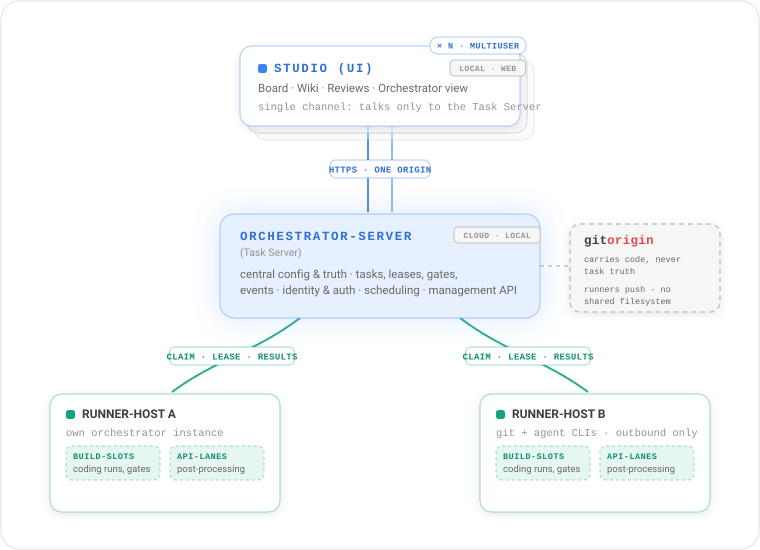
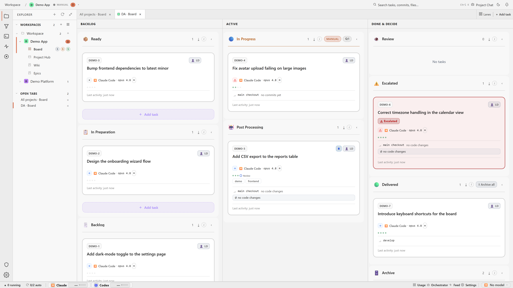
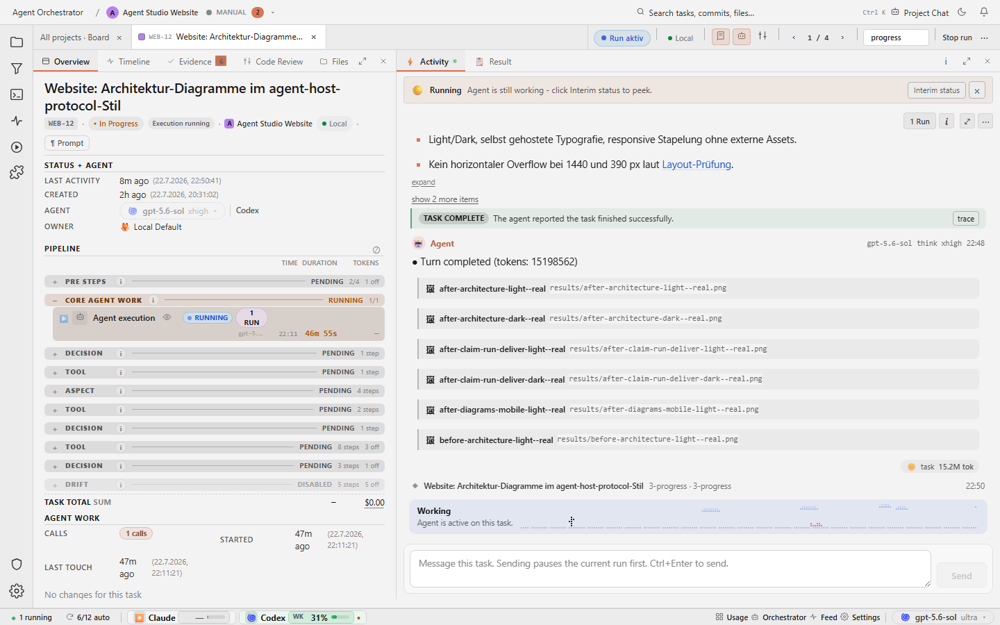

# agent-orchestrator

**Management layers on top of coding work.** Agents (Claude Code, Codex, GitHub Copilot, Gemini) write the code; this repository is the Studio: a task board, agent pipelines, and project wikis that assign, gate, review, and account for it.

<picture>
  <source media="(prefers-color-scheme: dark)" srcset="docs/media/architecture-dark.svg">
  
</picture>

## What you see





## What it provides

- Batch remote and local coding-agent work with task management in one place.
- Reduces cognitive load: task state, progress and evidence are visible instead of remembered.
- A management layer over autonomous agent runs: assign, gate, review, account.
- Works with your existing CLI subscriptions, or bring your own API keys.
- Runs fully local or distributed, your choice per project. Project chat follows
  the project's execution runner and shows its host, repository checkout,
  branch, and revision.
- Keeps the Task Server as the durable control plane while separately fenced
  Remote Review Executors inspect immutable result revisions.
- Runs review decisions, council reactions, post-processing, gate dispatch, and
  completion judging in the separate API-only Orchestrator Engine. Flow
  definitions and in-flight runs remain durable Task Server data, so restarting
  the Engine does not orphan work.

## Running locally

For a guided Linux x64 release install with no source checkout and no .NET
prerequisite, download
[`agent-orchestrator-setup`](https://github.com/agent-orc/agent-studio/releases/latest/download/agent-orchestrator-setup).
It offers an isolated Docker demo, a native single-machine install, and a
guided multi-machine join flow.

For development from source:

```bash
./api.sh
cd frontend
npm install
npm start
```

Or ask your coding-agent CLI to do it. For anything beyond the default setup, see the [setup guide](./docs/operations/setup/getting-started.md) and [AGENTS.md](AGENTS.md).

## More

For architecture, ADRs, contracts, and the full documentation index, see [agent-orchestrator.dev](https://agent-orchestrator.dev).
