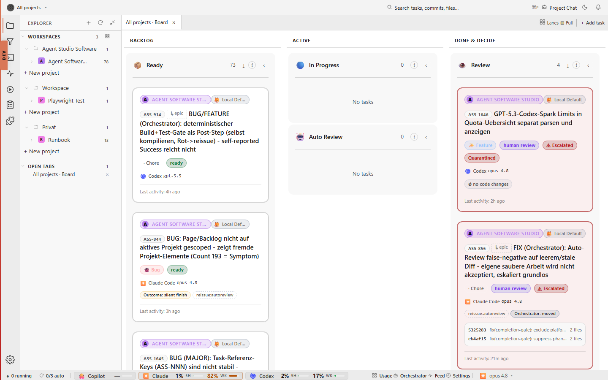
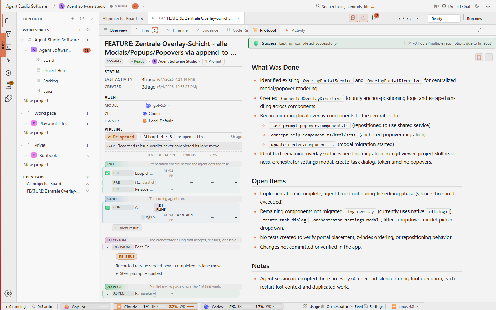
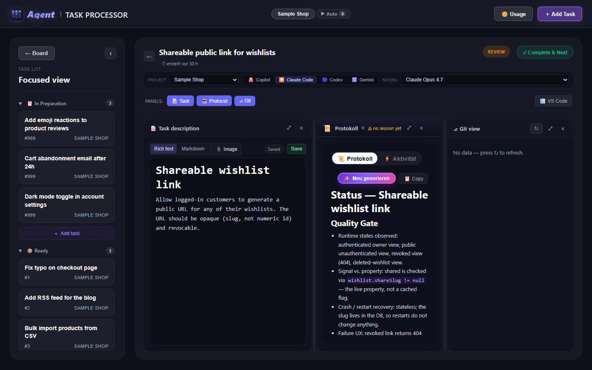

# agent-orchestrator

**Stop being the bottleneck.** A task workbench that feeds your coding-agent CLIs a continuous queue of work, using the subscriptions and execution environments you already trust.

> **Naming note:** The product is **`agent-orchestrator`** (kebab-case, identical to the domain `agent-orchestrator.dev` — developer-tool convention like `fly.io`, `vercel`, `stripe`). The repository slug and several runtime strings still say "agent-orchestrator" as a follow-up cleanup; see [docs/architecture-decisions.md](docs/architecture-decisions.md) for the load-bearing rename note.



> .NET 10 backend + Angular 21 PWA. Task state lives in `.orchestrator/jobs/` folders on disk; the Task Access API fronts the filesystem so the runner, supervisor, frontend, remote clients, and scripts read and mutate through one boundary. Runs tasks through Claude Code, Codex, GitHub Copilot, or Gemini. Coding work is sequential by default and can opt into bounded, orchestrator-gated parallelism via `maxParallelism`.

---

## Security first

agent-orchestrator makes security work repeatable instead of heroic. A human reviewer can miss an edge case because they are tired, rushed, or carrying the context in their head. A queued agent can spend millions of tokens on the same class of review every time, write down what it checked, preserve evidence, and leave a durable protocol for human review.

That is the product bet: **with enough inference budget, the right process, and documented evidence, AI-assisted review can become more thorough than ordinary human-only security review.** The goal is not to trust a model blindly. The goal is to put frontier cyber capability inside a controlled workflow: clear task scope, project conventions, repeatable skills, logs, screenshots, summaries, and review gates.

This also makes a second pattern more realistic: for small, well-scoped internal libraries, it can be safer to regenerate or modernize the library behind a strong review process than to carry stale, under-tested legacy code forever. That is not a blanket rule. Highly sensitive primitives such as PKI, TLS, cryptography, authentication boundaries, and certificate handling need stronger human review, specialist skills, and often conservative patching rather than casual generation.

The external signal is getting hard to ignore. UK AISI's April 30, 2026 evaluation of OpenAI GPT-5.5 found it to be one of the strongest models they had tested on cyber tasks, with a 71.4% average pass rate on Expert-level advanced cyber tasks at a 50M-token budget, and the second model to complete one of their multi-step cyber-attack simulations end-to-end. AISI also notes that performance on the 32-step range continued to scale with inference compute. That supports the central premise here: security quality depends on model capability, sufficient token budget, and a process that captures what happened.

Source: [UK AISI evaluation of OpenAI GPT-5.5 cyber capabilities](https://www.aisi.gov.uk/blog/our-evaluation-of-openais-gpt-5-5-cyber-capabilities).

---

## The bottleneck is you

Modern coding agents can run for hours. They don't get tired. They don't context-switch. They just need a steady queue of work.

The bottleneck isn't the model. It's the human babysitting it: paste a prompt, watch it run, review, paste the next one. Every minute spent on that loop is a minute your subscription's token bucket sits idle.

```
  WITHOUT a queue                          WITH agent-orchestrator
  ───────────────                          ─────────────────────────

  you ──► prompt ──► agent ──► review      queue ──► agent ──► review
   ▲                            │            │ ▲                │
   │       (idle, you blink)    │            │ │                │
   └────────────────────────────┘            │ └────────────────┘
                                             │   (auto pickup)
   utilization: ~10–20% of the hour          │
                                             ▼
                                          next task
                                          
                                          utilization: ~95% of the hour
```

The board exists to make the queue the only thing you maintain. Tasks land in `2-ready`, the runner walks them through `3-progress → 4-review` automatically, and your role shrinks to **review**, the one part that actually needs you.

---

## Principles

**A layer on top of agents and software.** The product surfaces what the agents did and what changed in your software in one place. The top level is condensed (run summaries, commit counts, status badges); drill-down is always one click away (full activity log, diffs, tool calls). The full UX contract is in [docs/design-principles.md](docs/design-principles.md) and is the bar every protocol-layer change has to clear.

**Make the patterns visible — and explain the why next to the lever.** A major part of this product is *exposing* the patterns and best practices the platform has accumulated, instead of hiding them in code or a wiki nobody opens. Every controllable behavior — agent permissions, sandbox modes, auto-commit/push, review thresholds, drift rules, skill catalog — should show up in Project Settings and the agent configuration surfaces *with* an inline explanation: what it does, why we picked this default, what the risk is, what the alternative would cost. The user should never have to leave the screen to understand a setting. Standalone docs in `docs/` remain the source of truth; the UI embeds the relevant section in-line at the spot the decision is made. See [docs/design-principles.md §Inline meta](docs/design-principles.md#inline-meta-explain-decisions-next-to-the-lever).

**A living orchestrator, not a hidden daemon.** The orchestrator should be someone the user can talk to, not just code that moves folders. Each project has a canonical orchestrator session with inspectable memory: what it was booted with, which tasks and decisions it has seen, what the project does, what the roadmap says, and what should happen next. The long-term concept is documented in [docs/orchestrator-chat.md](docs/orchestrator-chat.md).

**Sequential by default, bounded parallelism when opted in.** A project starts with one coding task at a time (`maxParallelism = 1`). When a project deliberately opts in, the orchestrator may admit several safe tasks at once, each isolated in its own git worktree on a short-lived `task/<id>` branch. Parallelism is capped, explained, and rejected for exclusive or cross-cutting work.

**Security is a first-class workstream.** Security review is not a side quest at the end of a feature. It is a repeatable project-level activity with its own skills, evidence, history, and review surface. The board should make it normal to ask "when was this last reviewed, what was checked, what changed since then, and what evidence supports the conclusion?"

**Drift is a first-class project risk.** Long-running agentic work can drift between human intent, specs, tasks, jobs, ADRs, code, tests, design references, README, AGENTS, and marketing promises. The most important version is software drift: the actual source code, runtime behavior, tests, schemas, and module boundaries must stay aligned with the documented architecture. A project should be able to define a compact high-level architecture map with at most ten elements, then track drift per element.

**Use what you already pay for.** The runner drives **your** Claude Code, Codex, Copilot, and Gemini CLIs through their current provider accounts, subscriptions, credits, and usage rules. The product does not ask for model API keys or become a second model-billing layer. Its job is to make the provider CLI capacity you choose visible, routed and reviewable at task level.

**Use existing coding agents, not a custom agent runtime.** agent-orchestrator deliberately sits above productized coding agents instead of rebuilding their agent loop against raw model APIs. Claude Code, Codex, Copilot, and Gemini already bundle planning, editing, tool use, approvals, authentication, model routing, and subscription economics. The app's job is queueing, lifecycle control, evidence capture, review handoff, and cross-CLI fallback. If a run gets awkward, the user can still drop into the native CLI or VS Code integration with the same subscription and provider-owned session artifacts where the provider exposes them.

Building a custom coding agent is not a forbidden idea. Many projects do it. It is out of scope for this product while the best price/performance sits in polished subscription coding agents, especially Codex and Claude Code. This boundary can be revisited if model economics or provider capabilities make API-native execution clearly better.

**Assisted-coding harness around the CLI run.** Each managed run has a pre/core/post shape. The app owns the pre-step (task scope, context, CLI choice, acceptance criteria, worktree/branch setup when needed), the core step starts the configured provider CLI as the execution engine, and the post-step collects output, logs, diffs, screenshots, checks, token or usage data where available, and the human review decision. That is the product boundary: assisted coding around a task, not a hidden replacement for the provider's agent loop.

**Maximize token utilization, keep bookkeeping load-bearing.** The default path stays small, and extra machinery appears only when it protects real throughput:

| What it skips | Why |
|---|---|
| Default worktrees | Worktrees are only created for opted-in parallel coding tasks; a normal serial project keeps the low-overhead path. |
| Virtualization / sandboxes | Adds startup latency and forces the agent to re-discover the workspace every run. |
| General workflow engines | Task admission, branch/worktree setup, commit, merge, and cleanup are explicit pipeline steps, not an unbounded DAG product. |
| API-key-based execution | Subscriptions already cover this. Paying twice is silly. |
| Custom API-backed coding agent loop | Existing agents already package the hard product work: tools, approvals, session history, auth, model routing, and IDE fallback. |

The product is small on purpose. Parallel coding is a controlled mode, not a blanket invitation to fan out agents until conflicts become inevitable.

---

## Today's capabilities

What the application currently provides.

### Board: every watched project, every state


The lanes (`0-backlog`, `1-preparation`, `1a-orchestrator-prep`, `2-ready`, `3-progress`, `4-auto-review` / `5-human-review`, `6-completed`, `7-archive`) are driven directly off the filesystem state. Each card carries up to thirteen chip types: task type, state, phase, execution, pending intent, auto-loop, review verdict, agent, model, token spend (with hover popover), git pill, last commit, last activity. The header strip shows free-text search, faceted filters across owner / project / type / tag with URL deep-links, lane collapse, and per-container focus mode. Drag-and-drop is optimistic with a snapshot-revert path.

### Detail panel: prompt + protocol + live git + triage



Per-task side panel that hosts ten sub-panes you can show, hide, and maximize: prompt editor (rich markdown), protocol view (parsed `status.md` + activity log + telemetry chips), live git pane with `diff2html` rendering, hygiene strip (committed / clean / synced), triage panel with `j` / `k` peer navigation and lane-decision actions (move / move-to-top / delete / start), command deck for the chat-compose strip, run timeline (one card per CLI invocation between user inputs), screenshot strip from `results/`, log overlay for the raw CLI buffer, and a verbose-debug overlay for read-only deep inspection.

### Project page: dedicated rails for project workstreams

Per-project shell with rails for the workstreams that matter beyond a single task: Security baseline + review history, Architecture drift with marble diagram and per-element scores, UX/UI design loops with screenshot evidence + council critique, project Token Usage with heatmap and expensive-jobs drill-down, Observability over the Agent Message Bus, Product Runtime telemetry, Steering Docs viewer. Cross-rail follow-ups (Security / UX/UI panels create tasks) flow into the create-job-dialog with pre-filled prompt + title.

### CLI integration: four agents through one boundary

Claude Code, Codex, GitHub Copilot, Gemini. Per-CLI model catalogue from `/api/cli/{type}/models`. Per-CLI quota visualisation in two forms: a compact donut strip in the status bar (at-a-glance "do I have headroom") and a denser sidesheet view (full per-CLI per-project session listing). Per-CLI admin panel for usage caps. Cross-CLI fallback when a session is stuck on one provider.

### Live data: visibility-aware polling

Five poll services keep the open detail and the board fresh without burning requests on a hidden tab: Claude session telemetry (5 s, claude-only), run timeline (5 s), session events (10 s), screenshots (10 s), and the CLI output buffer (custom cadence with two-buffer dedup against optimistic user echoes). All five share a `JobBackgroundPoller<T>` base; subclasses declare what to fetch + what to do with the response.

### Orchestration: deterministic, not prompt-trust

Per-project orchestrator owns queue movement. A long-lived orchestrator session carries the manager voice across runs and surfaces in a project-side sheet with chat composition and a project picker. The deterministic post-run policy parses `[[TASK_DONE]]` / `[[TASK_BLOCKED:<reason>]]` / `[[TASK_NEEDS_INPUT:<reason>]]` / `[[TASK_NOOP]]` sentinels from the CLI buffer; when the agent's report contradicts structural evidence (no edits, near-zero duration, after a session-loss recovery with a user follow-up), the orchestrator re-issues the work itself instead of accepting the inconsistency. The decision tree is matrix-tested. A supervisor layer above the runner observes health and budget every tick and emits typed advisories + interventions when something looks stuck.

### Token economy

First-class signal on every surface that touches inference. Per-job, per-project, per-model token aggregates persist in JSONL. The workspace token-timeline overlay (`#/workspace/tokens`) renders 1h / 6h / 24h / 168h windows. The status-bar usage hover panel combines quota windows + token totals in one modal. Per-project token-usage panel adds heatmap + expensive-jobs + per-job drill-down with run-by-run breakdown. Category split (`job` / `supporting` / `orchestrator`) follows the published taxonomy.

### Self-update

A nine-phase update pipeline (stop, pull, install, build, verify, restart, retry-on-failure) updates the dev or stable checkout from inside the running app. Update Center surface, version badge in the header, full-screen click-blocking block-modal that survives F5 because the FE keeps polling. Stable update through a separate `update-stable.sh` script that the FE triggers; the dev checkout pulls + builds locally. ADR-0031 records the load-bearing decision.

### Visual evidence

Per-task screenshot strip in the protocol pane plus a workspace-wide visual evidence reel (`#/workspace/screenshots`) grouped by hour bucket with lightbox prev / next navigation. Files live under each task's `results/`. Routable URLs serve the files directly so screenshots can be linked from chat or external review.

### Project chat (Slice D) and next-gen multi-actor chat surface

Project-scoped virtualised chat history with full-text search and a right-rail conversation map. Replaces the render-every-turn approach for projects with hundreds of turns; long-task budget under 50 ms during scroll burst is enforced by spec. Behind the `Frontend:NextGenChat` flag, a multi-actor `ConversationEvent` projection treats user, task agent, project orchestrator, supervisor, supporting agents, tool runner, and system warnings as distinct participants with persistent rails. The Verbose Debug overlay is the read-only deep-inspection variant of that projection.

### Foundation

.NET 10 backend (port 5030) + Angular 21 PWA (port 4010). Twenty-four JSON schemas under [`docs/schemas/`](docs/schemas/) cover Agent Message Bus events, supervisor advisories + interventions, drift reports, analysis reports, architecture model, product runtime events, token aggregates, task find / mutate, orchestrator decisions, and update-run snapshots. Twenty frontend feature folders under [`frontend/src/app/features/`](frontend/src/app/features/) carry the per-feature components / state / models with public APIs exported via barrel files (ADR-0034). Append-only Agent Message Bus persists every cross-cutting structured signal as JSONL.

Out of scope on purpose: API-key billing, mandatory sandboxes, general workflow engines, custom coding-agent runtimes, or unbounded fan-out. Worktrees and short-lived task branches are in scope only as the isolation mechanism for opted-in parallel coding (ADR-0052). The product is small by design; every capability above answers a question the existing CLI agents do not, while leaving them to do the actual coding.

### Review handoff: what makes a task review-ready



When a CLI run completes successfully, the application captures the run log, moves the task to `4-review`, writes a concise English protocol into `status.md`, and preserves review evidence such as screenshots under the task's `results/` folder.

Failed or stopped runs stay in `3-progress` so the user can inspect, restart, or continue them. The agent works on the selected task. The application owns pickup, continuation, stopping, state movement, protocol generation, slot admission, and worktree/branch lifecycle when parallel mode is enabled. That boundary is the point: the queue keeps moving without asking the model to decide what should run next.

---

## Deterministic orchestration over prompt trust

A second product principle, separate from the queue model: **the orchestrator is a deterministic arbiter, not a passive logger.** What the agent says about its own run is one input among several, never the only one.

This matters because prompt-based steering ("treat this as a continuation", "don't say done unless you actually did the work") fails silently. An agent that no-ops a follow-up after a session loss and replies "task done" used to slip through. The fix is structural:

1. **Hard signals from the agent.** Every prompt template asks the agent to end its run with one of `[[TASK_DONE]]`, `[[TASK_BLOCKED:<reason>]]`, `[[TASK_NEEDS_INPUT:<reason>]]`, or `[[TASK_NOOP]]`. These tokens are parsed from the output buffer and treated as authoritative. The full agent contract lives in [docs/agent-task-contract.md](docs/agent-task-contract.md).
2. **Deterministic post-run policy.** When the agent's report contradicts structural evidence (no edits, near-zero duration, after a recovery with a user follow-up), the orchestrator re-issues the work itself with a sharper framing instead of accepting the inconsistency. The decision tree is in `backend/Services/Runner/RunOutcomePolicy.cs` and is unit-tested as a matrix.
3. **An orchestrator voice in the chat.** The orchestrator is a first-class participant in the activity log (alongside `You` and the agent). When it re-issues a follow-up, accepts a heuristic verdict, or gives up after a retry, it says so in the chat so the user can see what the system decided and why. Heuristic fallback always surfaces a warning, so the user notices when the deterministic contract did not match.

The next chat surface extends this idea into a multi-actor conversation: user, task agent, orchestrator, supervisor, supporting agents, tools, and system warnings are separate participants. The design target is documented in [docs/mockups/chat-window-next-gen/](docs/mockups/chat-window-next-gen/); its integration plan makes the existing Activity Log, Trace mode, run timeline, side sheet, composer modes, and token/usage surfaces part of the migration instead of replacing them wholesale. The bridge slice has landed (`Frontend:NextGenChat` flag, shared `ConversationEvent` projection, fixtures, and the read-only Verbose Debug overlay); the remaining slices that wire the new renderer into the task Activity tab and the project side sheet are scoped in [docs/research/embedded-chat-integration-2026-05.md](docs/research/embedded-chat-integration-2026-05.md).

Prompt wording remains the easiest way to steer behavior, but it is not the load-bearing layer anymore. The product treats orchestrator-to-CLI communication as a core capability.

The next layer of this thinking is *supervision*: a meta-loop that watches the orchestrator's own job-pickup loop in real time, asks "is the agent on track, is anything stuck, should we intervene?", and writes its own continuous protocol. Implementation lives under [backend/Services/Supervisor/](backend/Services/Supervisor/) with a dedicated UI panel on each project page; auto-intervention stays opt-in. The full conceptual analysis (loop-to-loop control, communication contract, traceability) is in [docs/research/orchestrator-meta-loop-analysis-2026-05-04.md](docs/research/orchestrator-meta-loop-analysis-2026-05-04.md); the load-bearing decision is recorded as [ADR-0017](docs/architecture-decisions.md). A lower-frequency meta-cycle above the runner can pause at batch boundaries, inspect the system, write a structured report, then resume or queue follow-up work. Its current spec is [docs/mockups/orchestrator-meta-cycle/](docs/mockups/orchestrator-meta-cycle/) and the decision is [ADR-0022](docs/architecture-decisions.md). A stand-alone external review monitor (Layer 3) for stable lives at [scripts/supervisor/](scripts/supervisor/).

---

## Meta documentation, task evidence, and commits

Meta-level work is allowed to run as small, parallel CLI interactions when it is truly independent from active coding work. Examples: analyze the orchestration model, update README or ROADMAP, write a research note under `docs/`, then commit that documentation immediately. These commits are normal product-memory commits. They do not consume a coding slot because they do not execute task work inside a watched target project.

Recurring or manual meta-analyses are also product memory. Examples: "are we on track?", "what changed in the last few hours?", "which jobs are stale?", "does the queue match the roadmap?", "which docs drifted?", or "what should become follow-up work?" Their result should be a Markdown report for humans plus structured JSON when the app needs to aggregate, filter, or trend the findings. These reports belong in a project-level analysis area or in the relevant task evidence, depending on scope. They should reference raw evidence rather than copying entire logs, and any implementation follow-up becomes a normal queued task.

The orchestrator should use these reports to improve the steering layer over time. When multiple tasks show the same failure pattern, ambiguous prompt shape, recurring blocked reason, missing test expectation, or repeated CLI handling issue, a meta-analysis should point to the evidence and propose a README, AGENTS, task-contract, skill, or process update. That proposal must be visible and reviewable. The product should not secretly rewrite the instructions that agents rely on.

Agent-facing steering documents are product surface, not hidden implementation detail. A project page should make the relevant README, AGENTS, task contract, skills lookup, ADR index, and project-specific notes inspectable, with a shorter human summary on top that explains what the agents are being told and flags where the guidance looks stale, conflicting, or incomplete.

Task-level feedback is different. Security audits, code-review findings, task checks, screenshots, run protocols, and reviewer notes belong with the task evidence, usually in the watched project's `.orchestrator/jobs/<state>/<job>/` folder. If that evidence reveals new product work, create a normal queued task instead of burying the work inside the report.

Repositories should not stay dirty after a task is accepted. When a task reaches review or completion and its changes are accepted, the changed software and the task evidence should be committed promptly in the target repository and pushed unless the user has explicitly held the push back. The product should make uncommitted and unpushed task work visible so finished work does not quietly pile up on disk.

Direct-agent maintenance follows the same hygiene at the human session level: a small documentation, mockup, prompt, roadmap, or task-queue change should be committed and pushed as soon as it is coherent. That keeps project memory durable and avoids losing steering in a local checkout.

---

## Portable skills, not CLI-local silos

Skills are reusable specialist workflows: security review, Playwright visual verification, Angular UI work, backend API changes, log analysis, release preparation, and project-specific playbooks. They are **not** core lifecycle rules. Core orchestration is always active; skills are optional context that helps an agent do a situational workflow well.

The skill model has two layers:

1. **Central skill library.** agent-orchestrator owns the canonical skill library. Standard skills ship with the processor; project-specific skills are managed there too, scoped to one or more watched projects.
2. **Project lookup contract.** Each watched project should expose a small README or agent-instruction section that tells direct CLI agents where to find the relevant central skills. That keeps skills useful even when the user works directly in Codex, Claude Code, Copilot, or Gemini outside the orchestrator.

During a managed taskboard run, the orchestrator can attach selected skills to the prompt stack explicitly. During direct CLI work, the project's README acts as the common lookup point. Native CLI skill exports may be added later, but the Markdown lookup contract is the agent-neutral base.

The full concept lives in [docs/skills-architecture.md](docs/skills-architecture.md). The load-bearing decision is archived in [docs/architecture-decisions.md](docs/architecture-decisions.md).

---

## How it's wired

All task operations flow through the API. Direct filesystem mutation is reserved for the API host process.

The system is layered:

1. **Filesystem on disk.** The watched project's `.orchestrator/jobs/<lane>/<job>/` folders hold `job.json`, `prompt.md`, `status.md`, `logs/`, and `results/`. Disk stays the source of truth on cold start.
2. **Task Access API.** A typed software layer in the backend owns reads, lists, mutations, and lane transitions. It boots once, indexes every watched project's lane folders, watches the filesystem for external changes, serves cheap reads off the index, and accepts narrowly typed mutations. See [ADR-0024](docs/architecture-decisions.md) for the layer design and the queued `task-access-api-layer-extraction` work for the migration phasing.
3. **Services and clients consume the API.** The runner, the supervisor, the frontend PWA, the meta-cycle, and external scripts go through the API. They do not touch the lane folders directly. The same boundary mirrors mutations onto the [agent message bus](docs/agent-message-bus.md) so every cross-cutting structured signal lands in one observable timeline.

```
┌─────────────────────────────┐     ┌──────────────────────────────────┐
│  agent-taskboard/           │     │  Target project (e.g. C:\Proj\X) │
│  ════════════════           │     │  ═══════════════════════════════  │
│  App source code:           │     │  Where the agent works:          │
│  - backend/  (.NET 10 API)  │     │  - src/, lib/, ...               │
│  - frontend/ (Angular PWA)  │     │  - .orchestrator/                │
│  - docs/                    │     │    └── jobs/                     │
│  - .github/prompts/         │     │        ├── 1-preparation/        │
│                             │────►│        ├── 2-ready/              │
│  Hosts the Task Access API. │     │        ├── 3-progress/           │
│  Reads and mutates the      │     │        ├── 4-review/             │
│  target's jobs/ folder      │     │        ├── 5-completed/          │
│  through that one boundary. │     │        └── 6-archive/            │
└─────────────────────────────┘     └──────────────────────────────────┘
```

| Location | Contents |
|----------|----------|
| `agent-taskboard/` | App source, prompts, docs, Task Access API host |
| `<target-project>/.orchestrator/jobs/` | `job.json`, `prompt.md`, `status.md`, `logs/` per task |

One task processor, many targets. The board watches several projects in parallel. Inside each project, coding is serial by default and may become bounded parallel work only when the project opts into `maxParallelism`, the orchestrator admits the task, and the worktree isolation steps are active.

---

## Task Access API

The Task Access API is the canonical reference for every task operation. Agents, scripts, the frontend, the supervisor, and the meta-cycle all go through it. Direct filesystem reads or mutations are reserved for the API host process and for migrations or recovery work that deliberately exercise the on-disk contract.

Mutations require an `X-Client-Id` header so the layer can attribute the change to a registered client. Reads do not.

Canonical endpoints:

**Task lifecycle**

- `POST /api/jobs` - create a task. `CreateJobRequest` accepts `targetState` to land directly in `1-preparation` or `2-ready`.
- `POST /api/jobs/{id}/move?watchPath=...` - move a task to another lane.
- `PUT /api/jobs/{id}/state` - drive a task through a typed state transition.
- `POST /api/jobs/reorder` - reorder tasks within a lane.
- `DELETE /api/jobs/{id}?watchPath=...` - delete a task.
- `DELETE /api/tasks/orphan-folder` - delete a scanner-invisible terminal-lane residue folder with body `{"watchPath":"...","lane":"7-archive","folder":"..."}`. It refuses non-terminal lanes and folders that contain `job.json`, and logs `task-orphan-folder-deleted` / `task-orphan-folder-delete-failed`.
- `GET /api/jobs`, `GET /api/jobs/grouped`, `GET /api/jobs/{id}` - list and read.

**Task runner and content**

- `POST /api/jobs/{id}/start`, `POST /api/jobs/{id}/stop`, `POST /api/jobs/{id}/continue` - process lifecycle.
- `PUT /api/jobs/{id}/title`, `PUT /api/jobs/{id}/model`, `PUT /api/jobs/{id}/cli-type` - typed field updates.
- Git, attachments, run history, and per-run diff endpoints under the same `/api/jobs/{id}` group.

**Clients**

- `POST /api/clients/register` - register a client identity and obtain the `X-Client-Id` value.
- `GET /api/clients`, `GET /api/clients/{id}`, `DELETE /api/clients/{id}` - list, inspect, and retire clients.

**Supervisor and meta-cycle**

- `POST /api/supervisor/{project}/intervene/cancel-run`, `POST /api/supervisor/{project}/intervene/pause-pickup`, `POST /api/supervisor/{project}/intervene/force-fail`, `POST /api/supervisor/{project}/intervene/resume` - supervisor interventions.
- `GET /api/supervisor/{project}/meta-cycle` - meta-cycle status and recent reports.
- `GET /api/supervisor/{project}/observation`, `GET /api/supervisor/{project}/recent-events` - advisories, interventions, and recent activity for the project.

The wire shape for find / mutate is fixed in [`docs/schemas/task-find-result.schema.json`](docs/schemas/task-find-result.schema.json) and [`docs/schemas/task-mutation-request.schema.json`](docs/schemas/task-mutation-request.schema.json). The architectural decision is recorded in [ADR-0024](docs/architecture-decisions.md); the migration of the remaining direct-filesystem call sites is tracked under the queued task `task-access-api-layer-extraction`. Mutations are mirrored onto the [agent message bus](docs/agent-message-bus.md) as events.

---

## How to get started

Tell your favorite coding agent to clone the repository and to get it done. All necessary information needed to start the application is inside [AGENTS.md](AGENTS.md), so don't worry. Let the coding agent do the work.

If you want to install and configure manually, the technical walkthrough lives in [docs/getting-started.md](docs/getting-started.md).

---

## Docs

- [docs/README.md](docs/README.md) — **hierarchical lookup index** of every load-bearing document with a one-line description per file. Start here when you don't already know which doc to read.
- [AGENTS.md](AGENTS.md) — canonical agent instructions
- [ROADMAP.md](ROADMAP.md) — product direction, roadmap themes, and decision principles
- [PATHS.md](PATHS.md) — path conventions
- [prompts/runtime/](prompts/runtime/) — editable backend runtime prompt templates

The four most-asked-for individual documents (the index covers the full set):

- [docs/supported-clis.md](docs/supported-clis.md) — CLI integration contract
- [docs/filesystem-contract.md](docs/filesystem-contract.md) — task folder contract
- [docs/agent-task-contract.md](docs/agent-task-contract.md) — application and agent ownership boundary
- [docs/architecture-decisions.md](docs/architecture-decisions.md) — ADR archive with the load-bearing decisions
- [docs/orchestrator-chat.md](docs/orchestrator-chat.md) — persistent orchestrator chat, memory, scope, and control surface
- [docs/orchestrator-chat-redesign-handoff.md](docs/orchestrator-chat-redesign-handoff.md) — conversation-first chat redesign handoff
