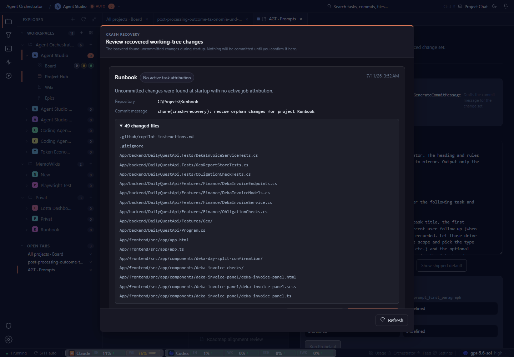

# Forty-nine files create a very tall fixed dialog with only Refresh visible. Add a compact summary, search or grouping, and keep the eventual decision controls visible without scrolling the entire file list.

## Finding

Board, Crash recovery modal with 49 files, desktop, dark: understandable recovery context, but the long file list dominates the viewport and weakens decision visibility.

## Evidence

Source capture: `board--crash-recovery-49-files--desktop--dark--real.png`

## Proposal

Forty-nine files create a very tall fixed dialog with only Refresh visible. Add a compact summary, search or grouping, and keep the eventual decision controls visible without scrolling the entire file list.

Estimated effort: **medium**  
Severity: **medium**
