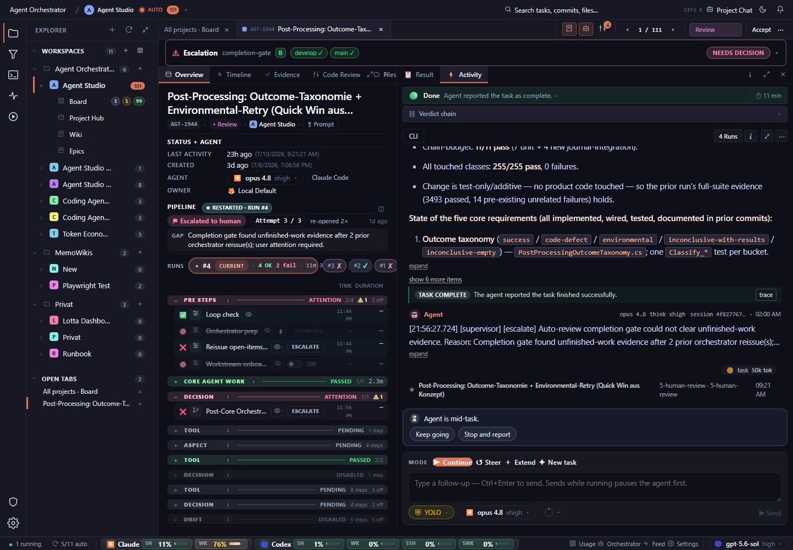

# Reduce simultaneous chrome and strengthen truncation affordances. Several titles, paths, and secondary labels end abruptly without an obvious reveal action.

## Finding

Task detail, ⚡Activity, desktop, dark: capable expert layout, but dense panes and truncated labels raise scan cost.

## Evidence

Source capture: `task-detail--activity--desktop--dark--real.png`

## Proposal

Reduce simultaneous chrome and strengthen truncation affordances. Several titles, paths, and secondary labels end abruptly without an obvious reveal action.

Estimated effort: **medium**  
Severity: **medium**
