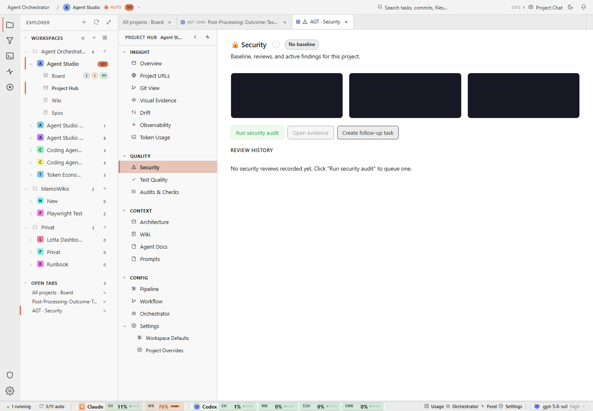

# Inspect the summary-card or canvas rendering path before assuming a text-contrast bug, then verify its fill and content rendering in both themes.

## Finding

Project Hub, Security, desktop, light: three solid black summary blocks render with no legible content.

## Evidence

Source capture: `project-hub--security--desktop--light--real.png`

## Proposal

Inspect the summary-card or canvas rendering path before assuming a text-contrast bug, then verify its fill and content rendering in both themes.

Estimated effort: **medium**  
Severity: **critical**
