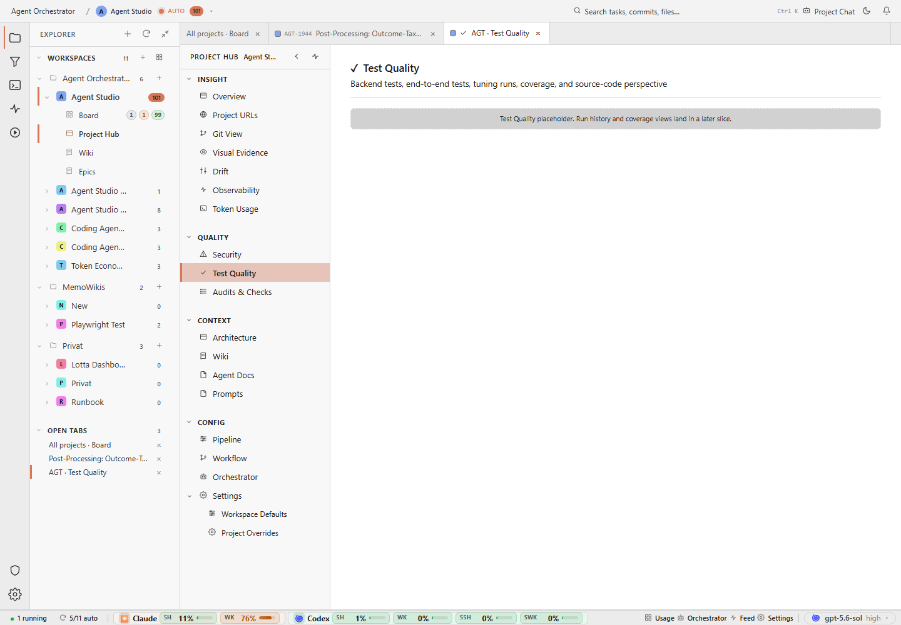

# Replace the placeholder strip with a meaningful empty state: what is unavailable, what will appear here, and the next useful action.

## Finding

Project Hub, Test Quality, desktop, light: visually clean but functionally barren placeholder state.

## Evidence

Source capture: `project-hub--test-quality--desktop--light--real.png`

## Proposal

Replace the placeholder strip with a meaningful empty state: what is unavailable, what will appear here, and the next useful action.

Estimated effort: **medium**  
Severity: **medium**
