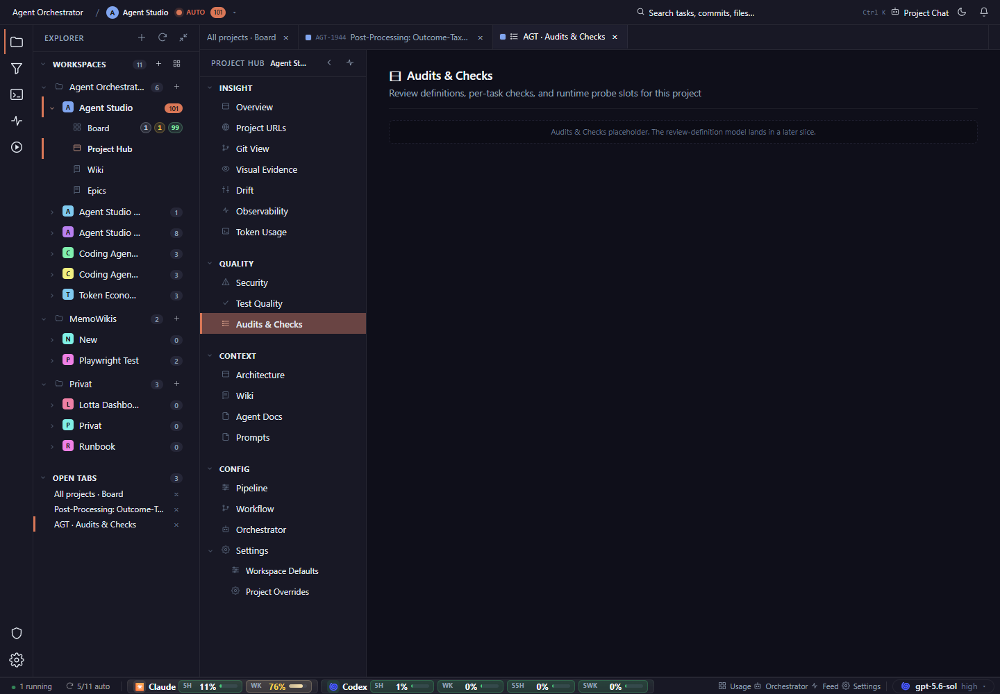

# Replace the placeholder strip with a meaningful empty state: what is unavailable, what will appear here, and the next useful action.

## Finding

Project Hub, Audits & Checks, desktop, dark: visually clean but functionally barren placeholder state.

## Evidence

Source capture: `project-hub--audits-checks--desktop--dark--real.png`

## Proposal

Replace the placeholder strip with a meaningful empty state: what is unavailable, what will appear here, and the next useful action.

Estimated effort: **medium**  
Severity: **medium**
