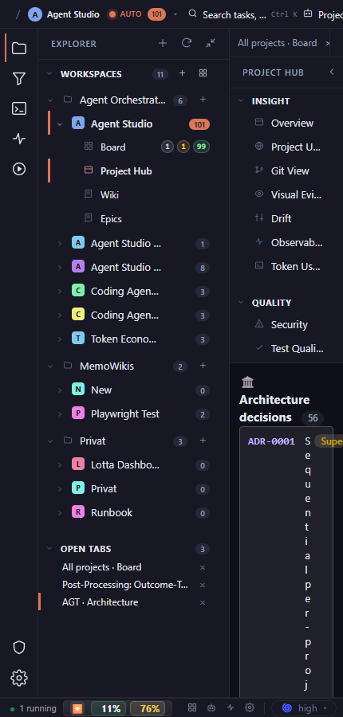

# Collapse both shell columns and remove forced word-breaking from ADR titles. Enforce a readable content minimum after navigation collapses.

## Finding

Project Hub, Architecture, narrow, dark: the ADR list is destroyed by character-by-character wrapping in the remaining content sliver.

## Evidence

Source capture: `project-hub--architecture--narrow--dark--real.png`

## Proposal

Collapse both shell columns and remove forced word-breaking from ADR titles. Enforce a readable content minimum after navigation collapses.

Estimated effort: **medium**  
Severity: **critical**
