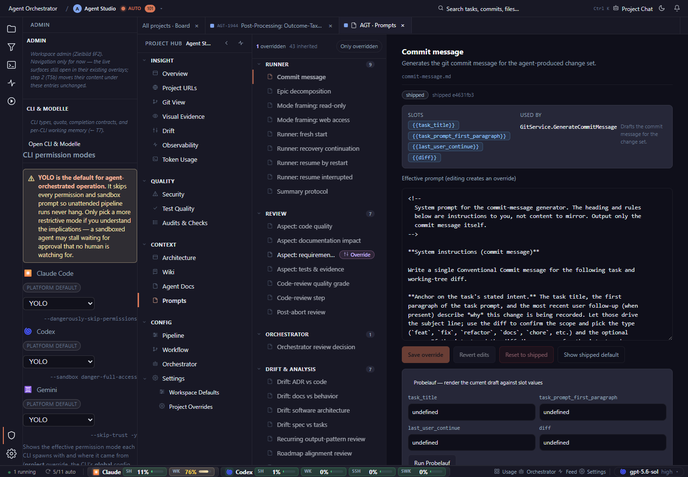

# Shorten the warning, move the detail behind help, and reduce repeated platform-default labels so the three selectors can be compared faster.

## Finding

Orchestrator administration, open, desktop, dark: useful but text-heavy administration rail competes with the page behind it.

## Evidence

Source capture: `orchestrator-administration--open--desktop--dark--real.png`

## Proposal

Shorten the warning, move the detail behind help, and reduce repeated platform-default labels so the three selectors can be compared faster.

Estimated effort: **medium**  
Severity: **medium**
