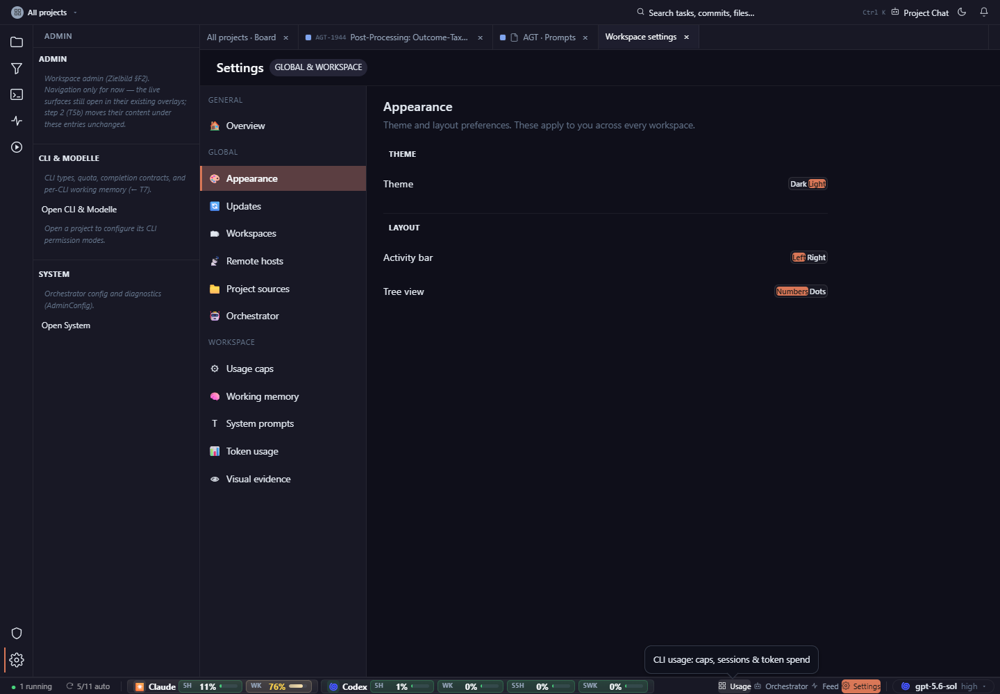

# Enlarge the segmented controls, separate option labels, and align them closer to their field labels instead of at the far edge of a wide row.

## Finding

Settings, appearance, desktop, dark: clear hierarchy, but tiny merged option labels resemble broken text rather than controls.

## Evidence

Source capture: `settings--appearance--desktop--dark--real.png`

## Proposal

Enlarge the segmented controls, separate option labels, and align them closer to their field labels instead of at the far edge of a wide row.

Estimated effort: **medium**  
Severity: **medium**
