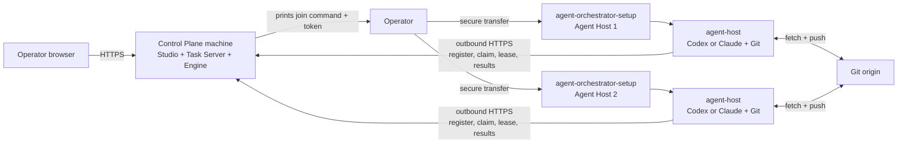

# Multi-machine setup

Use this guide when the Control Plane and one or more Agent Hosts run on
different Linux x64 machines. The same guided
`agent-orchestrator-setup` executable is used on every machine. The Control
Plane machine needs no Agent CLI. Each Agent Host needs Git and an authenticated
Codex or Claude CLI. No .NET SDK or runtime is required because all shipped
binaries are self-contained.

## Topology



Only the Control Plane accepts inbound application traffic. Agent Hosts make
outbound HTTPS requests to the Task Server and separate Git requests to the
registered origins.

## Before you start

On every machine, download the setup executable and its checksum from the same
release:

```sh
curl -fLO https://github.com/agent-orc/agent-studio/releases/latest/download/agent-orchestrator-setup
curl -fLO https://github.com/agent-orc/agent-studio/releases/latest/download/SHA256SUMS
grep '  agent-orchestrator-setup$' SHA256SUMS | sha256sum -c -
chmod +x agent-orchestrator-setup
```

The executable downloads the matching release archives and verifies each one
against `SHA256SUMS`. Use `--release-dir <path>` on an offline machine after
placing the three archives and `SHA256SUMS` in that directory.

Prepare the public DNS name and TLS termination for the Control Plane. The
host-visible Task Server URL must use HTTPS. Caddy remains host infrastructure;
the Control Plane archive contains the site template.

## 1. Install the Control Plane

On the Control Plane machine:

```sh
sudo ./agent-orchestrator-setup --mode control-plane
```

The guide asks for:

1. the private Task Server listener, normally
   `http://127.0.0.1:5071`;
2. the HTTPS URL visible from Agent Hosts, for example
   `https://tasks.example.com`.

It installs the Task Server and Orchestrator Engine as one versioned unit,
installs the matching static Studio files, waits for readiness, and prints:

```text
sudo ./agent-orchestrator-setup --join
```

followed by a join token. Configure the supplied Caddy template so the public
origin serves the Studio files and proxies `/api/*`, `/healthz`, and `/readyz`
to the private listener. Confirm from an Agent Host network:

```sh
curl -fsS https://tasks.example.com/healthz
```

### Join token handling

The `aosj1.*` value contains the Task Server URL, release version, and current
Task Server bearer credential. It is base64url encoded, not encrypted. The
checksum detects copy errors; it is not an authentication signature.

The token is reusable until the Task Server credential is rotated. This matches
the current separated Task Server bearer contract and must not be described as
a one-time enrollment. Transfer it through the same protected administration
channel used for host access. Do not put it in shell history, tickets, chat,
task text, or source control.

For automation, write it to a root-readable file:

```sh
sudo install -m 0600 /dev/stdin /root/agent-studio.join
```

Paste the token, send end-of-file, then use `--join-token-file`. Remove the file
after the host registers.

## 2. Prepare each Agent Host

Install Git and authenticate at least one supported host CLI as the Linux user
that will execute tasks:

```sh
git --version
codex --version
codex login status

# Or:
claude --version
claude auth status --text
```

Run the login on that host. Do not copy another machine's Codex or Claude
credential files. The setup guide checks the CLI as the selected execution
user before it writes or starts a service.

For GitHub HTTPS access, prepare a token before the credential-storage step:

- Prefer a fine-grained PAT owned by the organization or account that owns the
  repository. Limit it to assigned repositories and grant **Contents: Read and
  write** plus **Workflows: Read and write**.
- Use a classic PAT only as a compatibility fallback. It needs `repo` and
  `workflow`, plus organization SSO authorization when required.
- Prefer a dedicated machine account. A PAT belongs to the user who creates it,
  not to the organization.

The full repository credential and rotation contract is in
[Linux agent host: Token requirements](./linux-runner-host.md#token-requirements).

## 3. Join each Agent Host

Run on the Agent Host:

```sh
sudo ./agent-orchestrator-setup --join
```

Paste the join token at the hidden prompt. The installer then asks for the
execution user, host name, CLI, service role, Git probe origin, and maximum
parallelism. It:

1. verifies Linux x64, Git, systemd, the selected CLI version, and that CLI's
   host-owned authentication;
2. downloads and verifies the matching `agent-host` archive;
3. optionally stores the GitHub credential for both repository URL forms and
   runs both read checks;
4. writes the Task Server credential to a separate protected file;
5. installs and starts the role-specific systemd service;
6. waits until the Task Server reports that exact Agent Host registration.

To avoid a token in a paste prompt:

```sh
sudo ./agent-orchestrator-setup \
  --join \
  --join-token-file /root/agent-studio.join
sudo rm /root/agent-studio.join
```

The coding service is `agent-host.service`. A separately installed review role
uses `agent-host-review.service`, a different identity, environment, state
directory, and resource envelope.

## 4. Verify both sides

On an Agent Host:

```sh
systemctl is-enabled agent-host
systemctl is-active agent-host
journalctl -u agent-host --since '-5 minutes' --no-pager
```

In the Studio, open **Workspace Settings -> Execution Hosts**. The host name and
role must match the values entered in setup. Git capability can be:

- `ready`: read, push, and workflow updates are available;
- `ready-no-workflow-scope`: ordinary code work is available, but the PAT
  checklist must be completed before a task can change workflow files;
- `read-only`: the host is registered but new coding claims are blocked.

Add project repository URLs and assign projects to the Agent Host only after
the host is visible. The daemon always takes each project's Git origin from the
Control Plane registry.

## Repeat, update, or recover

Run the same setup executable again to repair the same release. Use a setup
binary from the target release for an upgrade so its release version and
downloaded archives stay aligned. Native Control Plane updates still use the
drain, readiness, and rollback contract in
[Release, installation, update, and rollback](../releases.md).

If registration fails, inspect the service journal first. Common causes are an
unreachable public URL, untrusted TLS, a rotated bearer credential, a CLI login
owned by another Linux user, or Git credentials that are read-only.
