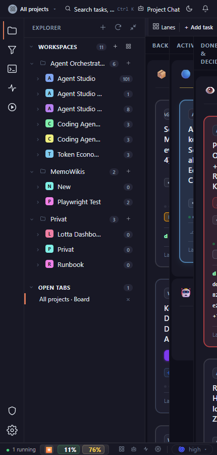

# Collapse the Explorer and secondary navigation into drawers. Do not preserve desktop column widths at 430 px; the primary content must get the full readable width.

## Finding

Board, All projects all lanes explorer open, narrow, dark: the requested content is reduced to a narrow clipped strip, with headings, controls, cards, or prose wrapping into fragments and horizontal overflow.

## Evidence

Source capture: `board--all-projects-all-lanes-explorer-open--narrow--dark--real.png`

## Proposal

Collapse the Explorer and secondary navigation into drawers. Do not preserve desktop column widths at 430 px; the primary content must get the full readable width.

Estimated effort: **medium**  
Severity: **critical**
