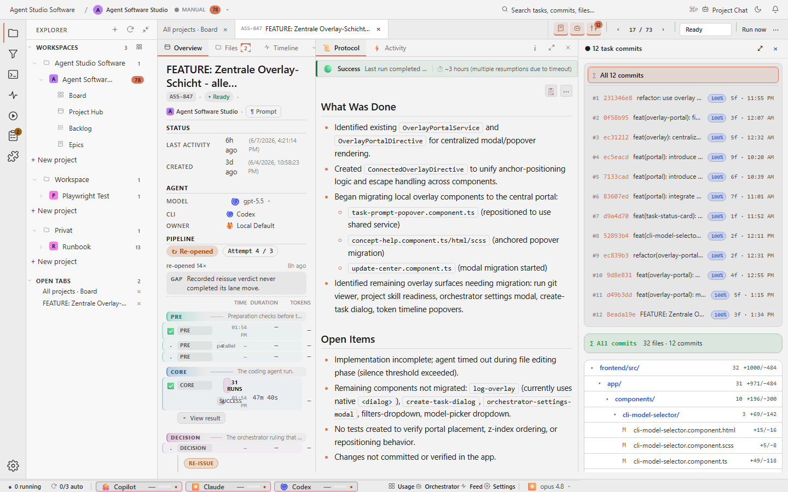

# Quality Gate Review

## Purpose

The quality-gate view shows that review is part of the task lifecycle. A task
can carry implementation evidence, protocol state, Git evidence, and quality
context before a human accepts or redirects it.



## Relevant State

- Route: `/tasks/<existing-agent-studio-task>`
- Viewport: `1440x900`
- Data state: existing Agent Software Studio task selected by the Playwright spec
- Visible state: protocol and quality-gate context are visible in the task detail

This state matters because quality checks should be evidence, not a private
claim from the agent.

## How To Recreate The Screenshot

Manifest id: `quality-gate-review`

```sh
./scripts/visual-docs/generate.sh
```

The Playwright spec:

1. Opens the preferred existing task card.
2. Restores prompt and protocol panes after the Git focus capture.
3. Waits for `pane-protocol`.
4. Captures `docs/assets/images/detail-quality-gate.png`.

## Marketing Usage

This image is used as `taskDetailQualityGate` in the marketing site. It should
support copy about quality gates, review evidence, and Angular Quality Rails.
