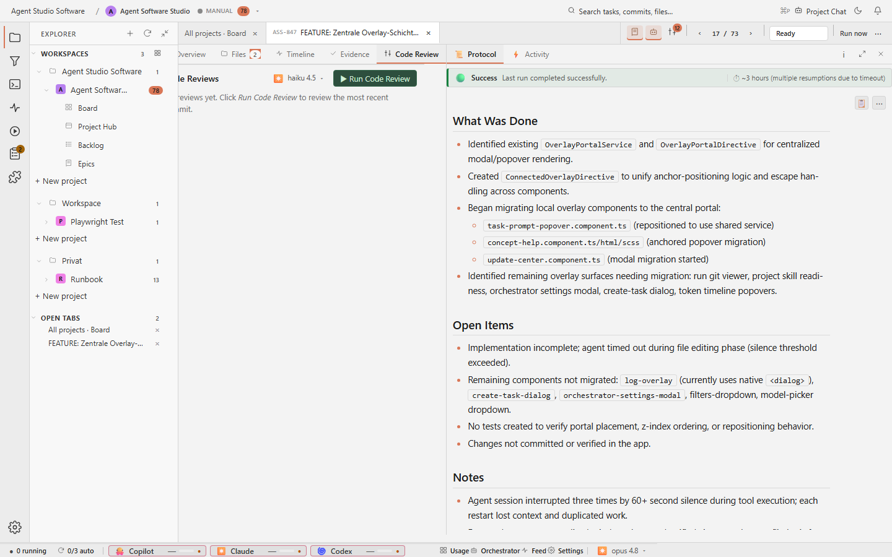

# Task Detail Code Review

## Purpose

The Code Review tab is the task-local place for review passes. A human can run
or inspect code review work without separating the review from the task that
produced the change.



## Relevant State

- Manifest id: `task-detail-code-review`
- Route: `/tasks/<existing-agent-studio-task>`
- Viewport: `1440x900`
- Data state: existing Agent Software Studio task selected from the live board
- Visible state: Code Review tab with model selector and review action

## How To Recreate The Screenshot

```sh
./scripts/visual-docs/generate.sh
```

The Playwright spec opens an existing task, clicks `prompt-tab-code-review`,
waits for `code-review-panel`, and captures
`docs/assets/images/detail-code-review.png`.

## Marketing Usage

Use this image to explain that code review belongs inside the guarded task
workflow.
