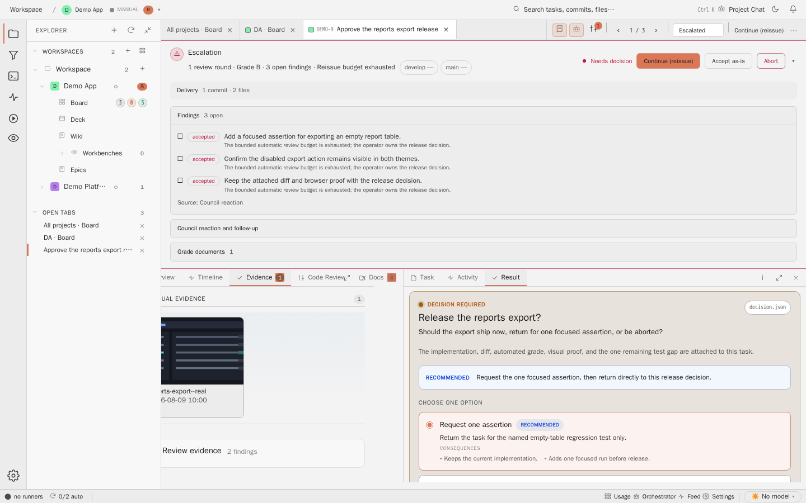
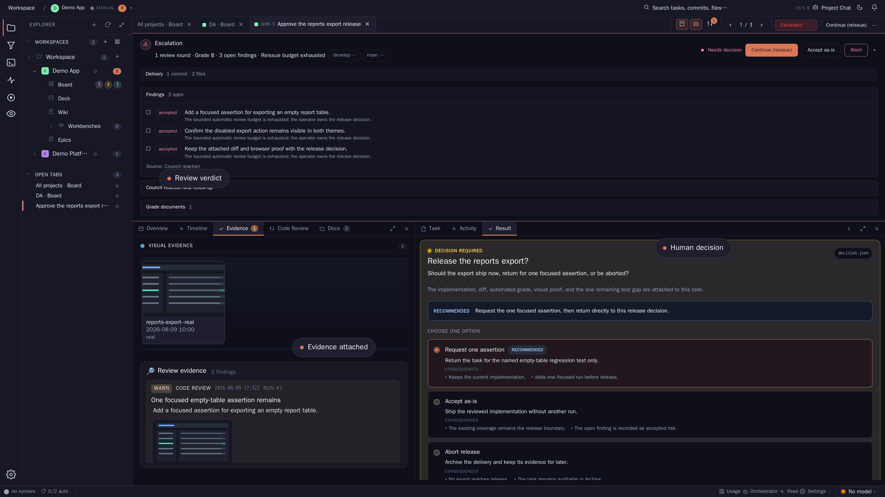

# Task Detail Evidence

## Purpose

The Evidence tab collects screenshots and review evidence for a task. This
keeps proof close to the work instead of forcing a reviewer to reconstruct it
from external tools.



The large landing-page variant combines the same task evidence with the review
verdict and explicit operator decision:



## Relevant State

- Manifest id: `task-detail-evidence`
- Landing manifest id: `landing-task-decision-detail`
- Route: `/tasks/DEMO-9`
- Viewport: `1440x900`
- Data state: pinned DEMO-9 task selected from the running product board
- Visible state: Evidence tab with visual evidence and review evidence regions

## How To Recreate The Screenshot

```sh
./scripts/visual-docs/generate.sh
```

The Playwright spec opens a pinned DEMO-9 task, clicks `prompt-tab-evidence`,
waits for `evidence-view`, and captures
`docs/assets/images/detail-evidence--pinned.png`.

## Marketing Usage

Use this image to show that evidence is first-class task data, not a
post-hoc screenshot pasted somewhere else.
