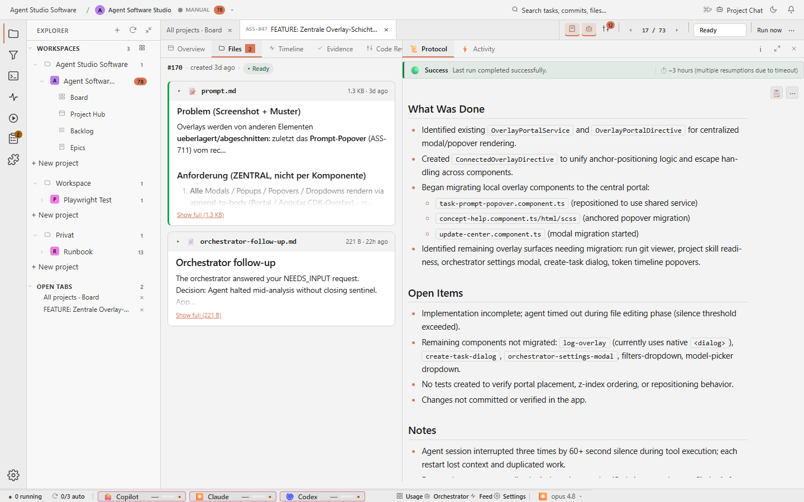

# Task Detail Docs

## Purpose

The Docs tab keeps task-local documents attached to the work while putting their
topics and conclusions first. Code reviews, verdicts, notes, and generated
Markdown or JSON reports open as readable documents before prompts and raw
artifacts. Technical file metadata remains available from each document menu.



## Relevant State

- Manifest id: `task-detail-files`
- Route: `/tasks/<existing-agent-studio-task>`
- Viewport: `1440x900`
- Data state: existing Agent Software Studio task selected from the live board
- Visible state: Docs tab with rendered outcome documents before source artifacts

## How To Recreate The Screenshot

```sh
./scripts/visual-docs/generate.sh
```

The Playwright spec opens an existing task, clicks `prompt-tab-description`,
waits for `files-pane`, and captures `docs/assets/images/detail-files.png`.

## Marketing Usage

Use this image to explain that Agent Studio keeps generated outcomes readable,
navigable, and inspectable as part of the task record.
