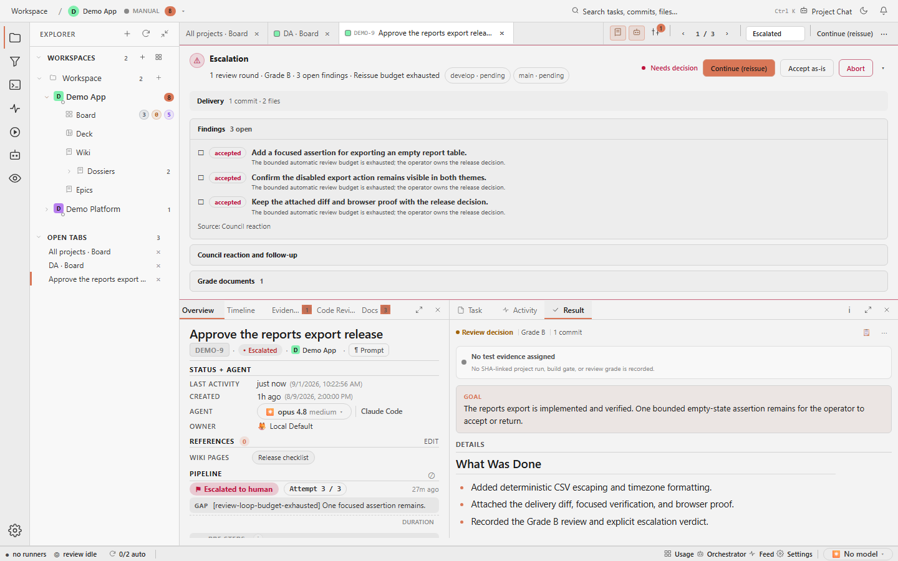

# Task Detail Protocol

## Purpose

The task detail view shows one unit of work. The protocol pane explains what
happened, what evidence exists, and why the task is ready for review.



## Relevant State

- Route: `/tasks/DEMO-9`
- Viewport: `1440x900`
- Data state: pinned DEMO-9 task selected by the Playwright spec
- Visible state: the Overview tab and the protocol pane (labelled Result in the
  inspector) are visible together

This state matters because a reviewer should not have to reconstruct task
history from a terminal transcript. The protocol pane keeps the review story
near the task.

## How To Recreate The Screenshot

Manifest id: `task-detail-protocol`

```sh
./scripts/visual-docs/generate.sh
```

The Playwright spec:

1. Opens `/`.
2. Opens the pinned DEMO-9 task card.
3. Waits for `pane-protocol`.
4. Clicks `inspector-tab-protocol`.
5. Captures `docs/assets/images/detail-protocol--pinned.png`.

## Marketing Usage

This image is available as `taskDetailProtocol` for Visual Documentation
Library copy. It should be used when the site needs to show that a screenshot
can carry route, state, and reproduction metadata.
