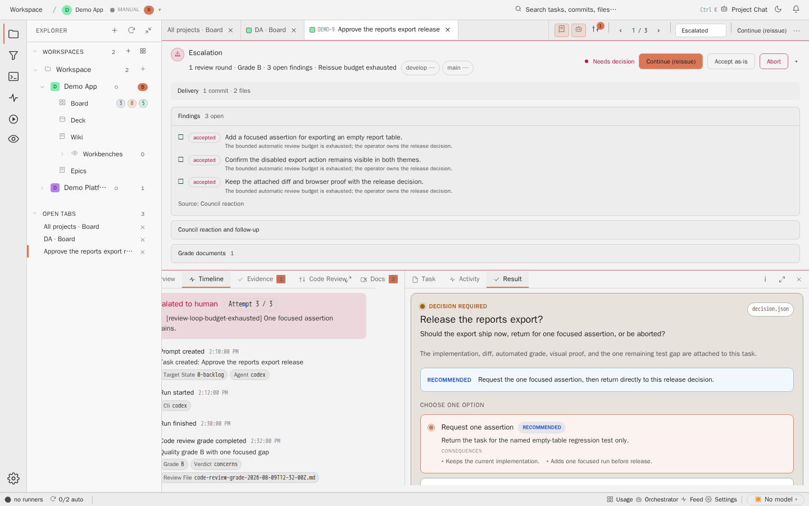

# Task Detail Timeline

## Purpose

The Timeline tab makes task progression inspectable. Events, verdicts, re-open
loops, and operator-visible progress are shown chronologically instead of being
left in scattered terminal output.



## Relevant State

- Manifest id: `task-detail-timeline`
- Route: `/tasks/DEMO-9`
- Viewport: `1440x900`
- Data state: pinned DEMO-9 task selected from the live board
- Visible state: Timeline tab with task events or the timeline empty state

## How To Recreate The Screenshot

```sh
./scripts/visual-docs/generate.sh
```

The Playwright spec opens a pinned DEMO-9 task, clicks `prompt-tab-timeline`, waits
for `timeline-tab`, and captures `docs/assets/images/detail-timeline--pinned.png`.

## Marketing Usage

Use this image to support claims about reviewable task progression and
decision history.
