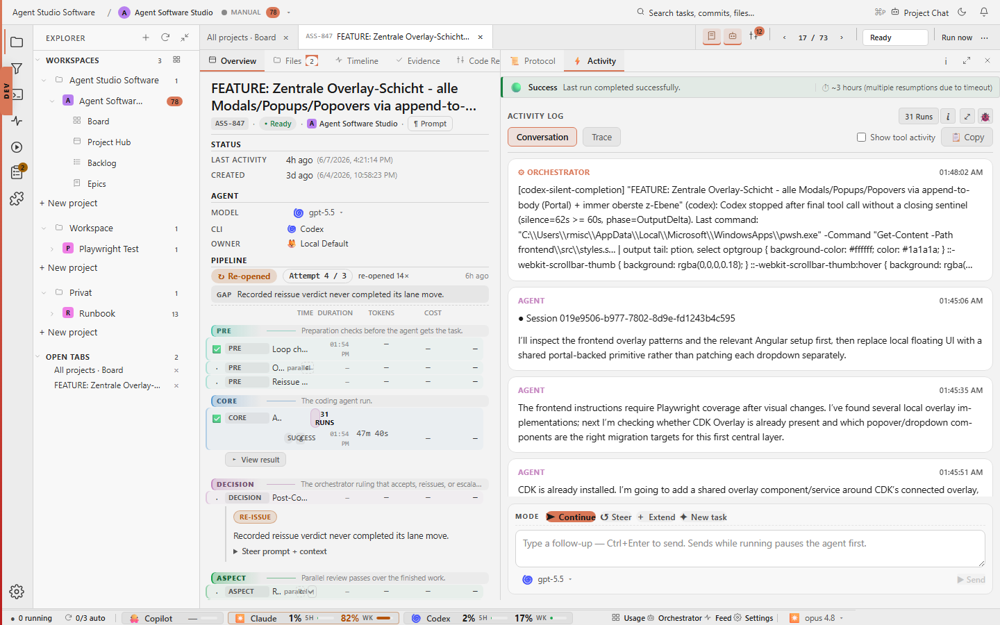

# Task Detail Activity

## Purpose

The Activity tab shows the operational side of a task: trace, conversation,
run activity, and the follow-up composer. It is where a human can inspect what
happened and steer the next step.



## Relevant State

- Manifest id: `task-detail-activity`
- Route: `/tasks/<existing-agent-studio-task>`
- Viewport: `1440x900`
- Data state: existing Agent Software Studio task selected from the live board
- Visible state: Activity tab in the protocol pane

## How To Recreate The Screenshot

```sh
./scripts/visual-docs/generate.sh
```

The Playwright spec opens an existing task, clicks `inspector-tab-activity`,
waits for `activity-panel`, and captures `docs/images/detail-activity.png`.

## Marketing Usage

Use this image for the Plus-One/Plus-N developer pattern and for copy about
human steering over agent work.
