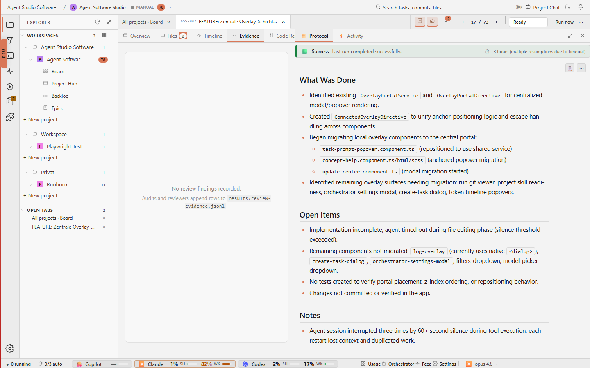

# Task Detail Evidence

## Purpose

The Evidence tab collects screenshots and review evidence for a task. This
keeps proof close to the work instead of forcing a reviewer to reconstruct it
from external tools.



## Relevant State

- Manifest id: `task-detail-evidence`
- Route: `/tasks/<existing-agent-studio-task>`
- Viewport: `1440x900`
- Data state: existing Agent Software Studio task selected from the live board
- Visible state: Evidence tab with visual evidence and review evidence regions

## How To Recreate The Screenshot

```sh
./scripts/visual-docs/generate.sh
```

The Playwright spec opens an existing task, clicks `prompt-tab-evidence`, waits
for `evidence-view`, and captures `docs/images/detail-evidence.png`.

## Marketing Usage

Use this image to show that evidence is first-class task data, not a
post-hoc screenshot pasted somewhere else.
