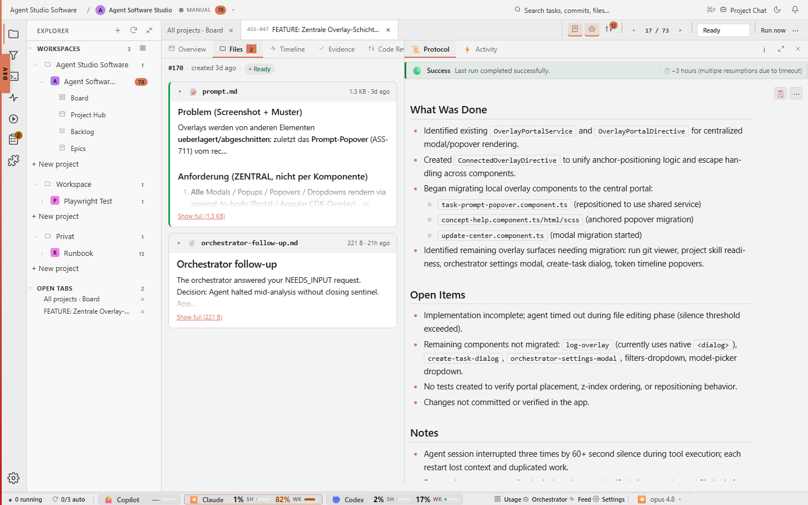

# Task Detail Files

## Purpose

The Files tab shows that task-local documents stay attached to the work. Prompt
files, notes, aspect reports, and generated Markdown artifacts can be reviewed
without leaving the task.



## Relevant State

- Manifest id: `task-detail-files`
- Route: `/tasks/<existing-agent-studio-task>`
- Viewport: `1440x900`
- Data state: existing Agent Software Studio task selected from the live board
- Visible state: Files tab with task Markdown artifacts

## How To Recreate The Screenshot

```sh
./scripts/visual-docs/generate.sh
```

The Playwright spec opens an existing task, clicks `prompt-tab-description`,
waits for `files-pane`, and captures `docs/images/detail-files.png`.

## Marketing Usage

Use this image to explain that Agent Studio keeps the task prompt and generated
documents inspectable as part of the task record.
