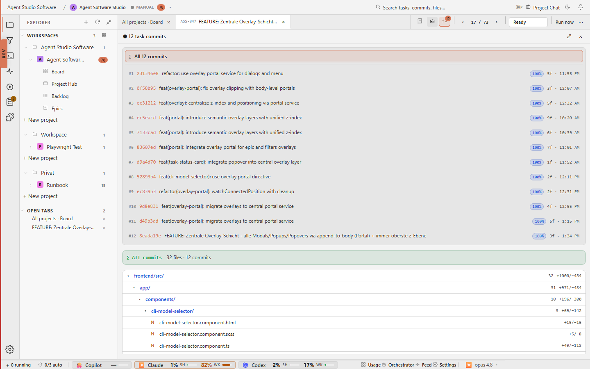

# Task Detail Git Focus

## Purpose

The Git focus state shows the code evidence directly: commits, changed files,
and file tree context. Review can temporarily focus on repository facts without
losing the task.



## Relevant State

- Manifest id: `task-detail-git-focus`
- Route: `/tasks/<existing-agent-studio-task>`
- Viewport: `1440x900`
- Data state: existing Agent Software Studio task selected from the live board
- Visible state: Git pane is visible while prompt and protocol panes are hidden

## How To Recreate The Screenshot

```sh
./scripts/visual-docs/generate.sh
```

The Playwright spec opens an existing task, enables the Git pane, hides prompt
and protocol panes, and captures `docs/images/detail-git-focus.png`.

## Marketing Usage

Use this image when the website needs to show that Agent Studio makes concrete
commit evidence inspectable.
