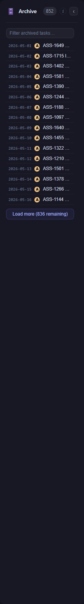
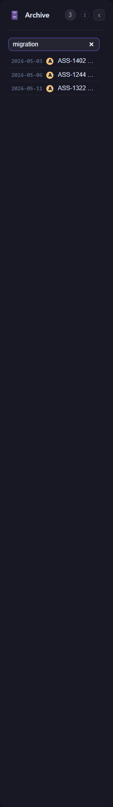
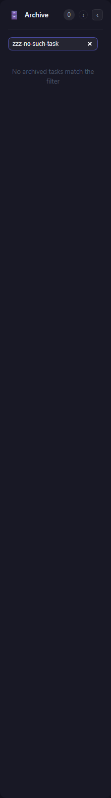

# ASS-1727 — Archive view empty despite 852 archived tasks

## Outcome

The fix is **already implemented and committed** on this branch in
`6edd9aa7 feat(archive): lazy-load archived tasks from dedicated paged endpoint`.
No further code change was required for this task; the work here is
verification + UI-acceptance evidence.

## Root cause & fix shape

The default board snapshot (`/api/tasks/grouped`) is served from a cached,
slim-hydrated scan that **deliberately excludes the terminal `7-archive`
lane** so the common board path never pays for scanning a large archive
(see `backend/Features/Tasks/TaskScannerService.cs` and the doc comment on
`GroupedJobs.archive` in `backend/Shared/Models/TaskInfo.cs`). That is by
design — `grouped.archive` stays empty. Before the fix the Archive lane bound
only to that empty array, so it always rendered empty even though hundreds of
archived tasks existed on disk.

The fix keeps the cheap default path intact and adds a dedicated, paged
read endpoint plus a lazy-loading Archive lane:

- **Backend** — new `GET /api/tasks/archive?watchPath=&offset=&limit=&search=`
  returning slim `ArchivedTaskInfo` rows + an honest unfiltered `total`
  (`backend/Features/Tasks/TaskCrudEndpoints.cs`). No existing endpoint was
  renamed.
- **Frontend** — the Archive column (`app-job-column`,
  `frontend/src/app/features/board/components/task-column/task-column.ts`)
  lazy-loads page 1 on init, pages via "Load more", debounces a text filter
  (300 ms, re-queries from offset 0), and shows the empty state **only** once a
  fetch resolves with a genuine `total === 0` (`archiveIsEmpty` guards on
  `archiveLoaded`).

## Automated test evidence (canonical correctness)

- **Backend — 5/5 pass** (`backend.Tests/TaskArchiveEndpointTests.cs`,
  real backend via `WebApplicationFactory<Program>`):
  - `Archive_ReturnsArchivedTasks_NewestFirst`
  - `Archive_Paging_SlicesStableOrder_TotalStaysFull`
  - `Archive_Search_FiltersByTitle`
  - `Archive_HidesFixtures_ByDefault_OptInWithIncludeFixtures`
  - `GroupedBoard_StillExcludesArchive_EvenWithArchivedFoldersOnDisk`
- **Frontend — 24/24 pass** (Vitest, incl. the archive-lane render spec
  `frontend/src/app/features/board/components/task-column/task-column.spec.ts`).

## UI-acceptance evidence (`--mocked`)

Captured against **this worktree's production build** (served by
`results/_static-server.mjs`) with the board boot API surface route-mocked by
`results/_archive-shot.mjs` (Playwright). The `/api/tasks/archive` mock honours
`offset` / `limit` / `search` exactly like the real handler; the unfiltered
`total` is reported as **852** to mirror the bug's data shape.

These are **`--mocked`** shots. A `--real` shot is not reachable from a dev job
worktree: the running dev stack (`:4010` / `:5030`) serves the canonical dev
checkout, not this branch, and `AGENTS.md` forbids bringing the dev backend up
from a job. Real-backend correctness is covered by the 5 endpoint tests above.

| State | Evidence | What it proves |
|-------|----------|----------------|
| Populated |  | Archive lane hydrates from the paged endpoint — count **852**, page-1 rows, "Load more (836 remaining)". The bug (empty lane) is gone. |
| Filtered |  | Typing `migration` re-queries from offset 0 → count **3**, exactly the three matching rows. |
| Empty |  | A no-match filter (`zzz-no-such-task`) yields a genuine `total === 0` → "No archived tasks match the filter". The empty state is shown **only** when truly empty, never over real data. |

### Notes on the harness

- The Playwright context blocks the app's service worker
  (`ngsw-worker.js`, enabled in the production build). Once active it intercepts
  `/api/**` from its own cache and bypasses the route mock, which would leave the
  lane on stale data; blocking it keeps every request flowing through the mock.
- The SignalR hub (`/hubs/jobs`) is aborted — push isn't part of this evidence
  (the lane hydrates over plain HTTP), so the resulting "failed to connect"
  console lines are expected and benign.
