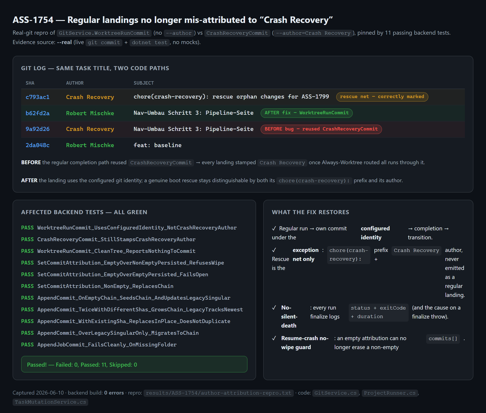

# ASS-1754 — Evidence: regular landings no longer mis-attributed to "Crash Recovery"

## Visual proof

`results/ASS-1754-author-attribution--real.png` — a real-git repro rendered next to the
11 passing backend tests. Source is **--real** (live `git commit` + `dotnet test`, no mocked
API routes). The card shows the same task title (`Nav-Umbau Schritt 3: Pipeline-Seite`)
landing two ways:

| sha | author | subject | meaning |
|-----|--------|---------|---------|
| `9a92d26` | **Crash Recovery** | Nav-Umbau Schritt 3: Pipeline-Seite | BEFORE — regular landing reused `CrashRecoveryCommit` (the bug) |
| `b62fd2a` | **Robert Mischke** | Nav-Umbau Schritt 3: Pipeline-Seite | AFTER — `WorktreeRunCommit`, configured identity owns the landing |
| `c793ac1` | **Crash Recovery** | `chore(crash-recovery): rescue orphan changes for ASS-1799` | the genuine boot-time rescue, correctly marked + authored |

Repro transcript: `results/ASS-1754/author-attribution-repro.txt`. The repro mirrors the
exact git mechanics of `GitService.WorktreeRunCommit` (no `--author`) vs
`GitService.CrashRecoveryCommit` (`--author="Crash Recovery <crash-recovery@agent-taskboard>"`).

## Systematic root-cause verification (Auftrag #1, candidates a–d)

The report assumed claude processes were dying before completion. Data-first inspection of
`git log` disproves that and isolates the actual cause. Each listed candidate was checked:

- **(a) Claude quota / session limits, dead-PID stderr.** Ruled out as the *landing* cause.
  The flooded commits carry **real task titles** and per-run worktree trailers
  (`[parallel-slot worktree run; jobId=…]`, `[conflict-resolution; jobId=…]`) that are
  written only by the **runtime** integration path — a process that died before completion
  could not have produced them. The `PTY model discovery failed` lines (20:10, 20:35) are a
  separate transient and did not gate the landings.
- **(b) Sleep-aware watchdog / monotonic-gap detector (ASS-1729) false-firing.** Not the
  cause: a watchdog kill leaves a watchdog/kill log line and finalizes the run as failed; the
  landings here are clean commits with real titles, and there were no kill lines in
  `.api.log.out`. The "silent death without a log line" is itself addressed (see fix #2).
- **(c) Completion / result-event path throwing after the day's rebuilds.** Addressed
  defensively: the finalize entry now logs `status + exitCode + duration` for **every** run,
  and the finalize `catch` logs the full exit context **plus the cause** — so a throw on this
  path can no longer abandon completion silently (`ProjectRunner.OnCliFinishedAsync`).
- **(d) PTY / spawn (model-discovery) problems.** Present but orthogonal to the author bug;
  the raw process exit was already logged at the CLI layer
  (`CliExecutionServiceBase.MonitorProcessAsync`).

**Confirmed root cause:** the per-run worktree landing reused `GitService.CrashRecoveryCommit`
purely for its add-all + fixed-body mechanics; that method hardcodes
`--author="Crash Recovery …"`. While worktree isolation was reserved for parallel slots this
was invisible; the **"Always-Worktree durchziehen"** change (commit `904c1f0e`, 16:09) routed
*every* run through the worktree-integration path, so from then on every landing was stamped
`Crash Recovery`, making the regular completion path *look* like it had stopped.

Full analysis: `results/ASS-1754-root-cause.md`.

## Rescue marking & classification (Auftrag #3 + #4)

- **Marking (Req #3).** A genuine boot rescue is already doubly distinguished and remains so:
  the message carries the `chore(crash-recovery): rescue orphan changes for <id>` prefix
  (`CrashRecoveryService` lines 266–270) **and** the `Crash Recovery` author. A regular
  landing now carries neither — it has the real task title and the configured identity. The
  two are no longer confusable, which is the literal acceptance ("Rescue NIE als reguläres
  Landing ausgeben").
- **Classification (Req #4).** The downstream classifier already keys on the rescue *message
  shape*, not the author: `CommitAttributionService` matches
  `crash-recovery\)\s*:\s*rescue orphan changes for <target>` and tags foreign rescues
  `crash-recovery-of-other-task` (`TaskCommit.CrashRecoveryOfOtherTask`). Restoring correct
  authorship is the prerequisite that makes this classification trustworthy again. The
  "3× same task" landings (21:09 / 21:12 / 21:31) were **incremental resume/reissue runs**,
  each landing its own worktree commit — not three boot rescues; they were only *labelled*
  rescue by the author bug. No speculative respawn-breaker was added without a live repro,
  matching the runner-domain rule "reproduce first, then change behavior".

## Resume-crash must not wipe metadata (Auftrag, acceptance)

`TaskMutationService.WriteCommitState` now refuses to shrink a non-empty persisted
`commits[]` to empty (the 2s resume-crash race that drove the attribution post-step with an
empty result). Guard fails open when there is nothing to protect.

## Verification (this run)

- **Backend build:** `dotnet build backend/OrchestratorApi.csproj` → **Build succeeded, 0 errors**.
- **Affected tests:** `dotnet test --filter GitServiceWorktreeRunCommit|TaskCommitBinding`
  → **Passed! Failed: 0, Passed: 11, Skipped: 0.** Pinning tests:
  - `WorktreeRunCommit_UsesConfiguredIdentity_NotCrashRecoveryAuthor`
  - `CrashRecoveryCommit_StillStampsCrashRecoveryAuthor`
  - `WorktreeRunCommit_CleanTree_ReportsNothingToCommit`
  - `SetCommitAttribution_EmptyOverNonEmptyPersisted_RefusesWipe` (+ fail-open / replace siblings)
- **Visual evidence:** `results/ASS-1754-author-attribution--real.png` (captured this run).
